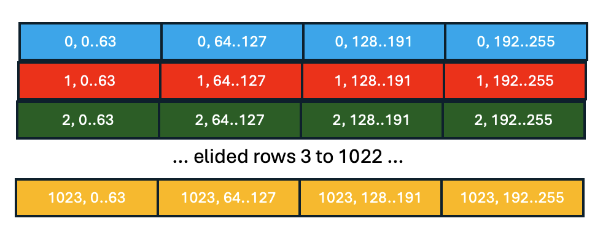
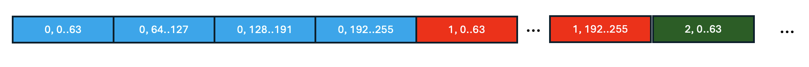
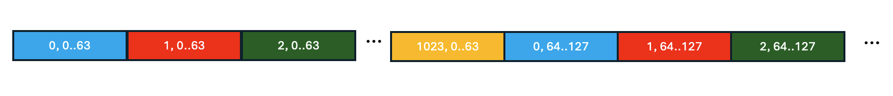

# Tensors with Device-Specific Layouts

**Authors:**
* @dgrove-oss
* @tardieu

## **Summary**

PyTorch tensors have a `size()` that describes their logical dimensionality.
When a tensor is realized, its elements must be laid out in some specific linear order
in memory. In PyTorch, the `strides()` of a tensor encode this linear ordering by specifying
for each dimension of the tensor the distance between consecutive elements of the dimension.
Commonly used linearizations including row major (dimension `-1` has stride `1`) and
column major (dimension `0` has stride `1`) can be naturally represented using `strides()`.
However `strides()` by itself cannot properly represent *tiled* tensors, which break the invariant
that the stride between every consecutive element in a dimension can be described by a single integer.
The goal of this RFC is to motivate the need for enabling tensors with a tiled device memory layout
as a first-class concept in PyTorch and to extend PyTorch's APIs and implementation
to naturally support them.

## **Motivation**

Tiling is a well-known and widely used technique for ordering memory accesses to
exploit spatial and temporal locality.  It improves program performance by enabling
more effective use of the memory subsystem, for example by matching working set sizes
to cache sizes, by using loaded values multiple times, and by grouping/ordering memory
requests to distribute them across memory banks and utilize all available bandwidth.

Tiling is typically realized by carefully arranging the iteration space of loop
nests to achieve the desired memory access pattern.  This works because the compiler
(or programmer) maintains a model of the actual linearized memory layout
of the tensor and uses that model to guide the loop transformations that result
in tiled memory access patterns.  In PyTorch, this model is represented in
the `FixedLayout` abstraction of the LoopLevelIR: the combination of `shape` and
`strides` encode the linearization and this information is used to inform the
compiler's loop reordering and tiling optimizations.  

However, even though the memory access patterns are tiled, the actual memory
layout of the tensor is not. Logically contiguous 2-D tiles are formed by accessing
non-contiguous chunks of memory.  For memory subsystems with substantial hardware managed caches,
this has traditionally not been a first order performance concern. However, there is
a diversity of AI accelerators that make different trade offs in the design of their
memory subsystems. In particular, for accelerators where there is a significant
performance advantage in making bulk loads from contiguous memory addresses, the
standard memory layouts for tensors are inadequate.  Optimizing memory system
performance (and thus program performance), requires that tiled memory access patterns
must be matched with a tiled memory layout.  Therefore we propose an extension to
Inductor's `FixedLayout` that we call `FixedTiledLayout`. It augments the `shape` and `strides`
from `FixedLayout` with an additional mapping to a higher-dimensional tensor
that encodes a tiled layout. We believe that this abstraction is a clean and extensible
way to enable the backend of inductor to reason about and exploit richer device memory layouts that
are essential to optimizing the performance of some classes of accelerators.

### Background: Spyre

We have been prototyping the concept of a tiled memory layout for tensors in the
context of IBM's Spyre accelerator.

Like many AI accelerators, IBM's Spyre is a SIMD engine. Most memory and compute
operations operate on fixed-sized chunks. On Spyre, we call this chunk of 128
bytes a _stick_. The importance of tiling for efficient computation is familiar
from GPUs but is even more important for dataflow accelerators built around
systolic arrays of SIMD units. Tensors are processed in fixed-sized _tiles_
matching the systolic array's dimensions.

Effective usage of Spyre's memory subsystem requires issuing access requests that
load multiple contiguous sticks of memory. This is necessary because in Spyre,
as is typical in such systems, the number of simultaneously outstanding memory
requests is limited.

### Contiguous Tiles

To maximize system performance, tensors are laid out in device memory in a
tiled fashion. Sticks belonging to the same tile are stored contiguously in
memory. As a consequence, sticks that are consecutive from the perspective of
PyTorch-level indexing (host `strides`) may not actually be consecutive on the device.

As a simple concrete example of a tiled tensor, consider a 2-D row-major float16
tensor with a size of `(1024, 256)`. Each stick contains 64 2-byte float16
values; therefore the 256 elements of each row form exactly 4 sticks. The
picture below shows a logical view of this tensor, highlighting how the rows are
divided into sticks.



In a standard row-major memory layout, the sticks of the tensor would be
linearized in memory as shown in the picture below. This is represented in
PyTorch with strides `(256, 1)`.



In contrast, using tiled tensors the sticks of the tensor would be linearized in
device memory as depicted in the picture below:



In effect, the 2-D tensor of size `(1024, 256)` is laid out in device memory as
if it were a 3-D tensor of size `(4, 1024, 64)` with strides `(65536, 64, 1)`.
Each row of the PyTorch tensor is broken into 4 non-consecutive sticks which now
form the outermost dimension of the 3-D tensor. As a benefit, the tensor on the
device is conveniently laid out into contiguous `(N, 64)` tiles with `1 <= N <=
1024` matching the width of the systolic array.

Generalizing to N dimensions with k tiling dimensions, the mapping between host
and device layouts can be represented as 3 tuples of N+k integers corresponding
to the loop ranges, host strides, and device strides of an N+k loop nest. By
convention we order the elements of the three tuples in decreasing device stride
order. Using this notation, the concrete example above would have the
specification: `((4, 1024, 64), (65536, 64, 1), (64, 256, 1))` which corresponds
to the loop nest below:

```
for i in range(4):
  for j in range(1024):
    for k in range(64):
      device_memory[device_tensor_address + i*65536 + j*64 + k*1] = host_memory[host_tensor_address + j*256 + (i*64 + k*1)]
```

### Padded Tensors

Memory subsystems, SIMD, or tiling constraints may result in padding
requirements. Spyre memory accesses are 128-byte aligned typically requiring the
innermost dimension (called _stick dimension_) of a tensor to be padded to the
next multiple of 128 bytes. Concretely a float16 tensor with size `(1000, 200)`
will be laid out on the device as a 3-D tensor with size `(4, 1000, 64)` so that
each row of the PyTorch tensor becomes 4 sticks with the last stick of each row
only comprising the last 8 elements of the row and 112 bytes of padding.

Tensors in host memory are typically not padded, or at least not padded as much,
so the mapping between host and device memory layouts described above is extended to
account for padding requirements.

### Operational Constraints

Accelerators may impose a number of constraints on the input and output memory
layouts of their operations. Spyre for example requires for optimal performance
that the two inputs of a dot product have identical memory layouts.

Operations producing smaller or larger output relative to input sizes may
consume or produce sparse tensors. When reductions operations are performed
along the stick dimension, Spyre’s SIMD engine produces results that only
contain a single element per stick.

### Implications of Tiled Device Tensor Layouts for PyTorch

To implement host/device memory transfers and device memory allocation for
accelerators with tiling and/or padding constraints, the runtime representation
of tensors must accurately capture the mapping of elements required to transform
the host memory layout to the device memory layout and vice versa.

For correct compilation and optimization, Inductor needs to accurately model the
device memory layout of tensors. Two key challenges are capturing the
multiple strides of tiled dimensions (impacts loop simplifications) and of sparse
and/or padded layouts (impacts memory planning and backend code generation).
Inductor has to ensure operands to an operation have compatible memory layouts
and derive the memory layouts of computed tensors.

Because layout constraints may be both hard and soft, resulting in a large search
spaces for device memory layouts, the programming model needs to have hooks that
enable programmers to provide hints or directives to guide or control device
memory layouts for tensors.

## **Proposed Implementation**

We describe our current implementation in `torch-spyre`. In the description we
use `Spyre` or `spyre_` to indicate a device-specific subclass or specialization
of an abstract `Device` or `device_` API.

### Runtime / Programming Model Support

We assume that each device plugin implements a `DeviceTensorImpl` which
is a subclass of `TensorImpl`. This subclass extends `TensorImpl` with
any additional data fields necessary to encode the on device memory layout
of the tensor.  This encoding is sufficient to allocate device memory for the tensor
and to implement the `to` and `cpu` operations to transfer tensor data between
the host and device memories.  It is exposed to the programmer as a `DeviceTensorLayout`.

APIs such as `to` and `new_empty` are extended to optionally take a `DeviceTensorLayout`
as an argument to enable the programmer (or compiler) to control the device memory
layout of a tensor.  If the optional argument is not given, the device runtime
will use its preferred default memory layout for the tensor.

In our implementation, we define a `SpyreTensorLayout` class and embed an instance
of it in the `SpyreTensorImpl` class.
`SpyreTensorLayout` stores the device size and strides,
a mapping between host and device dimensions, and padding/stick dimension
information. The 3 tuples mentioned earlier and needed for DMA operations
can be derived from `SpyreTensorLayout` and the host size and strides stored
in the `TensorImpl`.

This `SpyreTensorLayout` is initialized whenever a Tensor is
created on the Spyre device (eg. by using `to` to transfer a Tensor to
the device, by allocating a new empty Tensor on the device, etc).
We also provide a python API for `SpyreTensorLayout` that enable programmers
to easily create instances of it that describe commonly used device
memory layouts.

Instead of extending `to` and `new_empty`, our implementation currently provide alternative
functions `torch_spyre.to_with_layout` and `torch_spyre.new_empty_with_layout`.
These functions allow the programmer/compiler to provide a `SpyreTensorLayout`
that specifies the desired device memory layout of the tensor.

We also provide custom operations such as `torch_spyre.restickify` that enable
the programmer to create a copy of a tensor changing its stick dimension (thus
having a different `DeviceTensorLayout` than the source tensor).

### Compiler Support

For both correctness and optimization purposes, the on-device memory
layout of a tensor must be accurately represented in at least some layers of Inductor.

The main ideas of our prototype implementation are:

1. We add a subclass of `FixedLayout` called `FixedTiledLayout` that
adds a `device_layout` field that contains a `DeviceTensorLayout`.

2. We use the `DeviceTensorLayout` of the graph's example inputs to
construct the `FixedTileLayout` for all `InputBuffers`.  If example
inputs are not available, we generate code that assumes our default
on-device memory layout for tensor inputs.

3. We do a topological traversal of the `SchedulerNodes` using the
`_pre_fusion_custom_pass` extension point of the `Scheduler` to propagate
layout constraints and "upgrade" `FixedLayout` to `FixedTiledLayout`
on all `ComputedBuffers`.  In the process, we detect operations that
are infeasible on Spyre and raise compile-time errors.  In the future,
we intend to explore some amount of automated reshaping of intermediate
tensors to lessen the programmer burden of ensuring feasible operations.

With the `FixedTiledLayout` in place, subsequent passes over the LoopLevelIR
can be extended to use the device layout information as necessary.
For example the memory planner can use them to have accurate device tensor sizes
and the code generator can use them to generate host-code allocation calls and
optimized kernel loop nests.

## **Metrics**
 <!--
What are the main metrics to measure the value of this feature?
-->

TODO

## **Drawbacks**
<!--
Are there any reasons why we should not do this? Here we aim to evaluate risk and check ourselves.

Please consider:
* is it a breaking change?
* Impact on UX
* implementation cost, both in terms of code size and complexity
* integration of this feature with other existing and planned features
-->

TODO

## **Alternatives**
<!--
What other designs have been considered? What is the impact of not doing this?
-->
We initially prototyped adding `FixedTiledLayout` much early in compilation.
In particular, we enhanced `FakeTensor` and fake functions on the FX graph
to propagate device memory layouts.  A key advantage of this approach was
that it enabled a more intuitive description of the constraints and semantics of each
operation via the well understood fake function mechanism.  However, it required more invasive
changes to Dynamo and Inductor to preserve/propagate the information through many more
stages of compilation.  We therefore abandoned this approach and switched
to the approach described [above](#compiler-support) that confines all awareness
of tiled device memory layouts to the "middle" and "backend" stages of the LoopLevelIR layer of Inductor.

As described [above](#contiguous-tiles), the tiled memory layout of an
N-dimensional tensors with k stick dimensions could be encoded as an N+k dimensional
tensor using the existing `size()` and `strides()` APIs. A possible implementation
would be to simply have the compiler rewrite the FX graph to be in this form relatively
early in compilation. We identified several drawbacks of this approach:
* Unclear how to handle "user-visible" tensors such as graph inputs/outputs.
* Unclear semantics for non-Pointwise operations.  For example a matrix multiply
  on a 2-D tensor has a well-understood semantics; the semantics of a matrix multiply
  on a 3-D tensor where dimension 0 and 2 are the tiled dimension 1 are not standard.
* Does not by itself address enforcing the layout constraints of specific compute operations.
  
Similarly, we could defer exposing the tiled memory representation and extra dimensions
until Inductor's final code generation (following a similar pattern to how tiling is
implemented in the Triton backend of Inductor).  This is too late, because it blocks
us from effective use of Inductor for memory planning and cross-core work division
because these optimizations need an accurate view of the on-device representation of
tensors to perform their tasks.

## **Prior Art**
<!--
Discuss prior art (both good and bad) in relation to this proposal:
* Does this feature exist in other libraries? What experience has their community had?
* What lessons can be learned from other implementations of this feature?
* Published papers or great posts that discuss this
-->
TODO

## **How we teach this**
<!--
* What names and terminology work best for these concepts and why? How is this idea best presented?
* Would the acceptance of this proposal mean the PyTorch documentation must be re-organized or altered?
* How should this feature be taught to existing PyTorch users?
-->
TODO

## **Unresolved questions**
<!--
* What parts of the design do you expect to resolve through the RFC process before this gets merged?
* What parts of the design do you expect to resolve through the implementation of this feature before stabilization?
* What related issues do you consider out of scope for this RFC that could be addressed in the future independently of the solution that comes out of this RFC?
-->

## Resolution

TBD

### Level of Support
<!--
Choose one of the following:
* 1: Overwhelming positive feedback.
* 2: Positive feedback.
* 3: Majority Acceptance, with conflicting Feedback.
* 4: Acceptance, with Little Feedback.
* 5: Unclear Resolution.
* 6: RFC Rejected.
* 7: RFC Rejected, with Conflicting Feedback.
-->

#### Additional Context

### Next Steps

#### Tracking issue
<!---
<github issue URL>
-->

#### Exceptions
