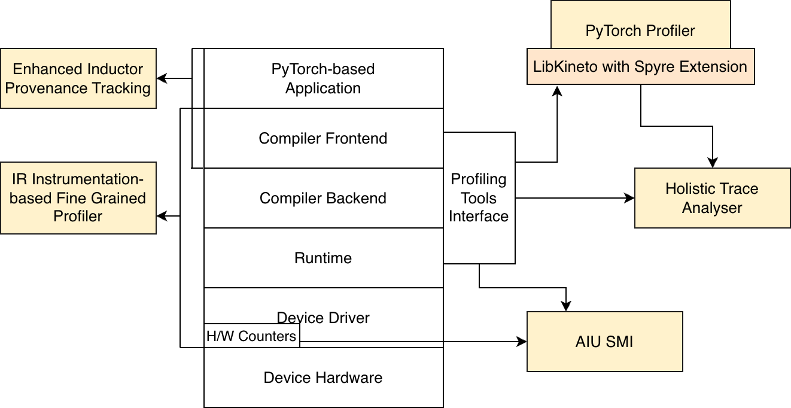
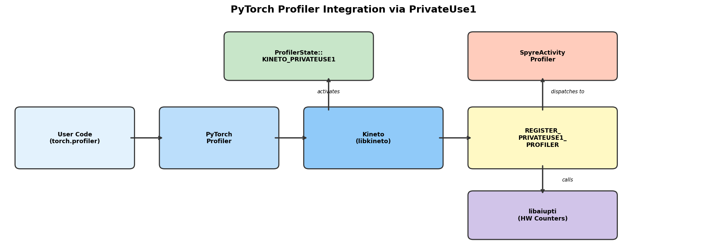
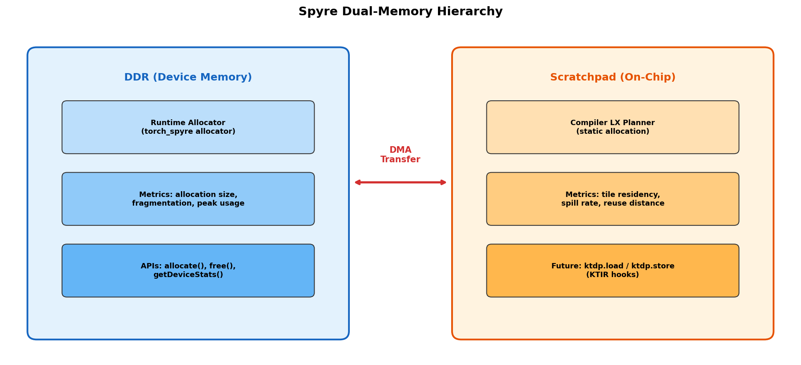
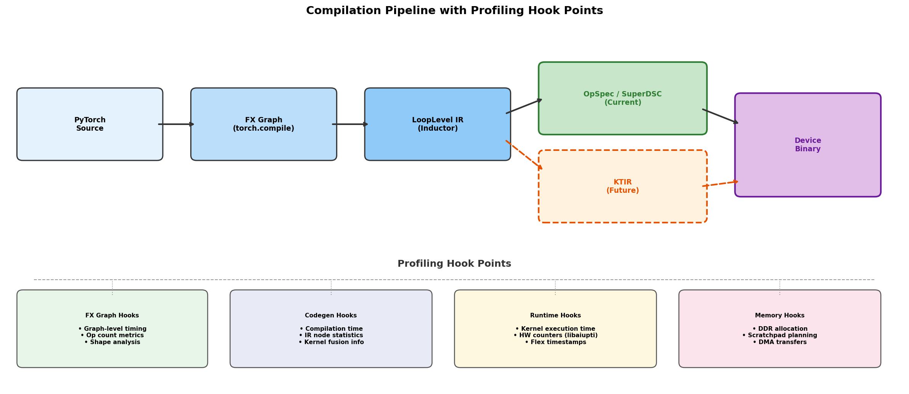

# Profiling Tools for Spyre

**Authors:**

* @kaoutar55
* @ppnaik1890
* @flop1971

**Tracking issue:**
[#1048](https://github.com/torch-spyre/torch-spyre/issues/1048)

**Related issues/EPICs:**

* [#601](https://github.com/torch-spyre/torch-spyre/issues/601) Spyre Profiling Toolkit (EPIC)

* [#563](https://github.com/torch-spyre/torch-spyre/issues/563) Memory Profiling
* [#596](https://github.com/torch-spyre/torch-spyre/issues/596) Nsight Compute Exploration
* [#713](https://github.com/torch-spyre/torch-spyre/issues/713) Dataflow Hardware Metrics
* [#714](https://github.com/torch-spyre/torch-spyre/issues/714) Testing Framework for Profiling
* [#767](https://github.com/torch-spyre/torch-spyre/issues/767) PT Utilization Metric
* [#769](https://github.com/torch-spyre/torch-spyre/issues/769) Dataflow Memory & Interconnect
* [#836](https://github.com/torch-spyre/torch-spyre/issues/836) Open Source and Upstream
* [#852](https://github.com/torch-spyre/torch-spyre/issues/852) CI/CD Profiling Pipeline
* [#856](https://github.com/torch-spyre/torch-spyre/issues/856) Analysis Pipeline
* [#857](https://github.com/torch-spyre/torch-spyre/issues/857) Observability & Telemetry
* [#858](https://github.com/torch-spyre/torch-spyre/issues/858) Environment & Reproducibility
* [#859](https://github.com/torch-spyre/torch-spyre/issues/859) Results Store & Visualisation
* [#860](https://github.com/torch-spyre/torch-spyre/issues/860) HW Counter Export
* [#924](https://github.com/torch-spyre/torch-spyre/issues/924) Profiling Overhead Benchmarking

---

## Summary

This RFC proposes a set of profiling tools for Spyre that will help
developers identify issues in the software stack, detect performance
bottlenecks, and reveal opportunities for optimization. These tools will
provide feature parity with profiling solutions on accelerators such as
NVIDIA GPUs and integrate with the PyTorch profiling infrastructure. In
addition, we aim to support performance analysis at multiple levels, from
end-to-end model execution to kernel and intra-kernel behaviour.

To enable this, we propose a novel accelerator-agnostic approach for
fine-grained, selective profiling at the intra-kernel level by
instrumenting observability hooks into the IR during compilation.

Overall, the goal is to provide actionable performance insights while
keeping profiling overhead low and offering clear visualization of
execution across Spyre and CPU.

## Motivation

As the Spyre software stack evolves across the compiler, runtime, and
PyTorch integration layers, achieving competitive performance requires
visibility not only into high-level PyTorch execution, but also into how
programs are lowered, scheduled, and run on the accelerator. Profiling
provides this visibility and helps understand hardware utilization,
identify inefficiencies, and guide effective optimizations that bring
tangible performance improvements.

Spyre's dataflow architecture introduces unique profiling challenges
compared to von Neumann accelerators:

1. **Execution model**: Workloads are represented as dataflow graphs
   with data token movement, not sequential instruction execution on
   control-flow graphs.
2. **No traditional threading constructs**: Concepts such as SMs and
   warps (NVIDIA) or CUs and wavefronts (AMD) do not exist. Metrics
   like utilization and stall behaviour are calculated differently.
3. **Different compiler optimizations**: Optimizations on the dataflow
   graph differ significantly from those on a control-flow graph.
4. **Dual-memory hierarchy**: Spyre has both DDR (device memory) and
   on-chip scratchpad memory, with explicit DMA transfers between them
   managed by the compiler and runtime.
5. **Multi-core work division**: Up to 32 cores per accelerator, with
   compiler-driven work division across cores.

As a result, existing profiling tools are often not directly applicable
to Spyre, as many target specific hardware or assume a control-flow
execution model. This necessitates a Spyre-specific profiling approach.

## Proposed Implementation

The primary objective of this RFC is to add support for profiling at
different levels across the Spyre software stack and hardware. Towards
this aim, we plan to build a **Spyre Profiling Toolkit** comprising
multiple tools working at different levels and granularities.



*Spyre Profiling Toolkit architecture showing how profiling
tools interact with different layers of the stack — from the PyTorch
application through the compiler frontend/backend, runtime, device
driver, and hardware. The Profiling Tools Interface (libaiupti) serves
as the central integration point, feeding data to the PyTorch Profiler
(via LibKineto with Spyre Extension), the Holistic Trace Analyser, and
Spyre SMI.*

The toolkit spans the full stack:

| Layer | Tool | Granularity |
|-------|------|-------------|
| Application / PyTorch | Spyre Extension for PyTorch Profiler | Kernel-level |
| Compiler Frontend | Enhanced Inductor Provenance Tracking | Pass-level |
| Compiler Backend | IR Instrumentation-based Fine-Grained Profiler | Intra-kernel |
| Runtime | Profiling Tools Interface (libaiupti) | Kernel + memory |
| Device Driver / HW | Spyre SMI | Device-level |
| Post-processing | Holistic Trace Analyser for Spyre | Derived metrics |

### Spyre SMI

We plan to build a System Management Interface (SMI) for Spyre,
similar to NVIDIA-SMI, for monitoring Spyre devices. This tool will
query the Spyre device driver to obtain metrics such as:

* Power consumption and temperature
* Busy % and PT array utilization %
* Bandwidth (device memory read/write, PCIe rx/tx, RDMA read/write)
  and corresponding request rates
* Reserved and active memory
* Process-to-VF mapping (Spyre's virtual function isolation)

```bash
$ spyre-smi
+-----------------------------------------------+
| Spyre SMI                                      |
+===============================================+
| VF  | Temp  | Power | PT Util | Mem Used/Total |
|-----|-------|-------|---------|----------------|
|  0  | 42°C  | 38W   |   72%   | 2.1G / 16.0G  |
|  1  | 40°C  | 35W   |   65%   | 1.8G / 16.0G  |
+-----------------------------------------------+
| PCIe BW: rx 12.4 GB/s  tx 8.2 GB/s            |
+-----------------------------------------------+
```

Spyre SMI will interact with the compiler/runtime to obtain information
such as PTs utilized and memory usage of processes using the Spyre
device. We are evolving Spyre SMI to work with **libaiupti**, which
will handle the hardware counter collection and VF mapping.

### Spyre Extension for PyTorch Profiler



*PyTorch Profiler integration flow showing how user code
reaches Spyre hardware through the Kineto →
REGISTER\_PRIVATEUSE1\_PROFILER → SpyreActivityProfiler → libaiupti
path, with Flex control block timestamps as the timing source.*

#### Integration Strategy

For profiling NVIDIA, AMD, and Intel GPUs, PyTorch Profiler uses an
underlying library called Kineto, which provides plugins to interface
with the profiling tools (CUPTI, Roctracer/Rocprofiler-sdk, and XPUPTI,
respectively). PyTorch now supports out-of-tree accelerator profiling
via the `REGISTER_PRIVATEUSE1_PROFILER` macro
(pytorch/pytorch#172154), which allows PrivateUse1 backends to register
an `IActivityProfiler` implementation with Kineto. torch-spyre will
use this mechanism as the primary integration path.

**Note**: A Kineto provider plugin for Spyre was previously developed
and merged upstream (Kineto PR 1126, `plugin/aiupti` directory).
This plugin is not actively used — the real implementation lives in
IBM/kineto-spyre. Once the new `REGISTER_PRIVATEUSE1_PROFILER` path
is validated end-to-end, we will deprecate and remove the upstream
`plugin/aiupti` directory from Kineto.

#### ProfilerStubs Registration

torch-spyre will register profiler hooks through the PrivateUse1
`ProfilerStubs` interface. The following hooks will be implemented:

| Hook | Spyre Implementation |
|------|---------------------|
| `record()` | Capture device event via libaiupti timestamp |
| `elapsed()` | Compute elapsed time from control block timestamps (nanoseconds) |
| `synchronize()` | Wait for all in-flight Spyre operations to complete |
| `onEachDevice()` | Iterate across active VFs (virtual functions) |
| `enabled()` | Return `true` when `USE_SPYRE_PROFILER=1` and libaiupti is loaded |

**Timing source**: Spyre uses Flex control block timestamps converted
to nanoseconds. Unlike GPU stream-based events, Spyre's dataflow
execution model means "event completion" is defined as the point when
all output tokens of a kernel have been written to their destination
(DDR or scratchpad).

#### ProfilerActivity Registration

With pytorch/pytorch#172154 merged, PrivateUse1 backends can now
register an `IActivityProfiler` factory via the
`REGISTER_PRIVATEUSE1_PROFILER` macro. This uses the
`ProfilerState::KINETO_PRIVATEUSE1` profiler state, which routes
activity collection through the registered profiler without requiring
a dedicated `ProfilerActivity` enum value.

torch-spyre will implement a `SpyreActivityProfiler` class that
inherits from `libkineto::IActivityProfiler` and register it via:

```cpp
REGISTER_PRIVATEUSE1_PROFILER(SpyreActivityProfiler)
```

The profiler is initialized through the `onKinetoInit()` callback
path in `kineto_shim.cpp`, which is triggered during
`prepareTrace()` when a user starts profiling.

#### Usage Example

```python
import torch
import torch_spyre
from torch.profiler import profile, ProfilerActivity

model = torch.compile(MyModel().to("spyre"))
inputs = torch.randn(1, 3, 224, 224, device="spyre", dtype=torch.float16)

with profile(
    activities=[ProfilerActivity.CPU, ProfilerActivity.PrivateUse1],
    record_shapes=True,
    profile_memory=True,
) as prof:
    output = model(inputs)

# Print a summary table of kernel execution times
print(prof.key_averages().table(sort_by="self_device_time_total"))

# Export a Chrome/Perfetto trace for visualization
prof.export_chrome_trace("spyre_trace.json")
```

#### Provided Metrics

This integration will provide:

* Input shapes for each operation
* Execution and memory timelines for CPU and Spyre operations
* Call stack and file/line numbers
* Spyre kernel name, execution time, and invocation count
* Reserved, allocated, and peak memory for the workload

### Memory Profiler Integration



*Spyre's dual-memory hierarchy — DDR (device memory)
managed by the runtime allocator and observable at runtime, and
scratchpad (on-chip) managed by the compiler's LX planner and
observable at both compile-time and runtime. DMA transfers move data
between the two.*

Spyre has a **dual-memory hierarchy** that requires special handling:

| Memory | Managed By | Observable At |
|--------|-----------|--------------|
| DDR (device memory) | Runtime allocator | Runtime |
| Scratchpad (on-chip) | Compiler + LX planner | Compile-time + runtime |

#### DDR Memory Tracking

The Spyre runtime allocator will emit allocation and deallocation
events compatible with PyTorch's memory profiler. This enables:

* `torch.spyre.memory_allocated()` — current DDR usage
* `torch.spyre.max_memory_allocated()` — peak DDR usage
* `torch.spyre.memory_reserved()` — reserved DDR pool size
* `export_memory_timeline()` — DDR allocation timeline

```python
import torch
import torch_spyre

model = torch.compile(MyModel().to("spyre"))
inputs = torch.randn(1, 3, 224, 224, device="spyre", dtype=torch.float16)

torch.spyre.reset_peak_memory_stats()
output = model(inputs)

print(f"Current DDR usage:  {torch.spyre.memory_allocated() / 1e6:.1f} MB")
print(f"Peak DDR usage:     {torch.spyre.max_memory_allocated() / 1e6:.1f} MB")
print(f"Reserved DDR pool:  {torch.spyre.memory_reserved() / 1e6:.1f} MB")
```

#### Scratchpad Memory Tracking

Scratchpad memory is managed by the compiler's LX planner and is not
directly observable through the same runtime hooks. We will expose:

* **Peak scratchpad utilization** — maximum scratchpad in use
* **Average utilization** — mean usage across kernel execution
* **Fragmentation** — ratio of unusable free space to total free space
* **Reuse rate** — allocation efficiency metric

These metrics will be collected via the runtime's LX planning metadata
and reported through both `torch.spyre.memory_*` APIs and the
aiu-trace-analyzer.

### Holistic Trace Analyser (HTA) for Spyre

HTA is a PyTorch tool for post-processing traces generated by the
PyTorch profiler to aid in performance debugging. It enriches traces by
adding information generated through analysis, including:

* Process memory consumption breakdown
* GPU execution time breakdown (computation, communication, memory,
  idle)
* Overlap analysis between communication and computation
* Kernel launch analysis and idle time analysis

A tool called **aiu-trace-analyzer** has already been developed and
open-sourced, providing a subset of these metrics for Spyre workloads.

#### Current Limitations

* Depends on compiler logs for utilization and kernel category
  information
* Supports single-Spyre workloads only
* HTA's APIs are GPU-specific (e.g., `get_gpu_kernel_breakdown()`,
  `get_idle_time_breakdown()`)

#### Planned Improvements

1. **Achieve metric parity with HTA** — implement all analysis
   capabilities for Spyre traces.
2. **Remove compiler log dependency** — obtain required information
   directly from Spyre runtime and libaiupti.
3. **Multi-Spyre support** — correlate timelines for communication
   kernels across Spyre cards (up to 8 cards per ensemble).
4. **Device-agnostic abstraction layer** — contribute upstream to HTA
   to decouple its analysis from GPU-specific assumptions, enabling
   reuse for Spyre and other accelerators.
5. **Perfetto visualization** — target Perfetto as the primary trace
   viewer (TensorBoard's tb\_plugin is deprecated).

### IR Instrumentation-based Fine-Grained Profiler

To enable profiling at an even finer granularity and to aid kernel
performance improvements, we plan to design and develop a novel
profiler based on code instrumentation as part of the compilation
stages. Currently, instrumentation hooks will target the
OpSpec/SuperDSC IR. With the transition to KTIR (RFC 0682), the
instrumentation target will shift to the `ktdp` dialect, where
operations such as `ktdp.load`, `ktdp.store`, and
`ktdp.construct_access_tile` provide natural and well-defined hook
points for observing memory access patterns, DMA transfers, and
compute tile utilization.

The aim of this profiler is to provide the user with a way to specify
one or more operators they want to investigate, and obtain the following
insights for those ops. For example, a user could selectively profile
a `torch.matmul` operation:

```python
import torch
import torch_spyre
from torch_spyre.profiling import instrument

# Selectively instrument specific ops for fine-grained profiling
model = MyModel().to("spyre")
compiled_model = torch.compile(
    model,
    options={"spyre_instrument_ops": ["aten.mm", "aten.addmm"]},
)

inputs = torch.randn(1, 3, 224, 224, device="spyre", dtype=torch.float16)
with instrument(metrics=["execution_time", "dma_latency", "pe_util"]) as prof:
    output = compiled_model(inputs)

# Per-op intra-kernel breakdown
prof.print_report()
# ┌──────────┬───────────┬───────────┬──────────┐
# │ Op       │ Exec (μs) │ DMA (μs)  │ PE Util% │
# ├──────────┼───────────┼───────────┼──────────┤
# │ aten.mm  │     124.3 │      18.7 │    87.2  │
# │ aten.addmm│     98.1 │      12.4 │    91.5  │
# └──────────┴───────────┴───────────┴──────────┘
```

#### Kernel-Level Metrics

* Execution time per kernel
* Memory footprint (DDR and scratchpad)
* Communication bottlenecks:
  * Host-to-device (H2D) and device-to-host (D2H) DMA transfer time
  * Multi-AIU communication overhead
* Energy consumption

#### Intra-Kernel-Level Insights

* Memory access patterns over time to identify hot memory areas
* Compute bottlenecks and PE utilization
* Backpressure stalls (downstream consumer cannot accept data)
* Data starvation (upstream producer has not delivered data)
* DMA transfer latency between DDR and scratchpad

#### Dataflow-Specific Metrics

These metrics are unique to Spyre's dataflow architecture and have no
direct analog in von Neumann profiling:

| Metric | Description |
|--------|-------------|
| Pipeline utilization | Fraction of functional units active per cycle across the dataflow graph |
| DMA overhead | Transfer time between DDR and scratchpad |
| Reconfiguration latency | Time to load new dataflow configurations between kernels |
| Inter-core communication | Work division efficiency across up to 32 cores |
| Stick alignment overhead | Padding/reformatting cost for 128-byte stick misalignment |
| Three-level parallelism | Inner-graph parallelism, pipelining parallelism, inter-graph parallelism |



*Compilation pipeline with profiling hook points — each
profiling tool attaches at a specific stage, from kernel-level PyTorch
Profiler at the source through pass-level provenance tracking,
intra-kernel IR instrumentation, to device-level hardware counters.
The dashed KTIR box shows the future pipeline stage that will replace
OpSpec/SuperDSC.*

### Spyre Extension for Inductor Provenance Tracking

Provenance Tracking is a feature in Inductor that helps debug the
compilation process. Currently, it shows three panels to visualize the
FX graph, the lowered ATEN IR, and the generated SuperDSC IR, along
with the lineage of ops across these three stages.

#### Current Limitation

Since provenance tracking is restricted to three stages, we can only
observe the end product of all compilation passes applied to the
workload graph.

#### Proposed Extension

We plan to extend this tool by adding the option to view the IR after
any compiler pass as specified by the user. This enables:

1. **Per-pass IR visualization** — select any number of applied passes
   and display the resulting IR for each.
2. **Backend compiler extension** — extend beyond the Inductor into the
   backend compiler to visualize IRs generated by those passes.
3. **End-to-end mapping** — generate a mapping from PyTorch source code
   through the full compilation pipeline. The current pipeline is:

   ```text
   PyTorch source → FX Graph → LoopLevelIR → OpSpec → SuperDSC → device binary
   ```

   With the adoption of KTIR (RFC 0682), the pipeline will transition
   to:

   ```text
   PyTorch source → FX Graph → LoopLevelIR → KTIR → device binary
   ```

   The provenance tracking design must support both pipelines during
   the transition period.

4. **Profiling annotation** — annotate the provenance mapping with
   profiling information from the fine-grained profiler.

#### Integration with torch-spyre Compilation Pipeline

Spyre's codegen targets OpSpec/SuperDSC today, not Triton. With the
planned transition to KTIR (RFC 0682), the backend IR will move to
a tile-based MLIR representation (`ktdp` dialect). The provenance
tracking integration will:

* Emit `inductor_provenance_tracking_node_mappings.json` artifacts
  compatible with PyTorch's tlparse visualization pipeline
* Embed debug handles in OpSpec and SuperDSC output (current pipeline)
* Extend debug handle embedding to KTIR operations once the KTIR
  transition is underway — KTIR's explicit `ktdp.load`/`ktdp.store`
  and access tile operations provide well-defined anchor points for
  provenance metadata
* Provide a Spyre-specific viewer for stages beyond standard Inductor

### First Failure Data Capture (FFDC)

Profiling tools can be leveraged to accelerate debugging and aid
automatic failure captures. We will implement failure capture in three
profiling modes:

| Mode | Overhead | Use Case |
|------|----------|----------|
| Always-on | <5% | Production monitoring |
| Standard | 10-15% | Active debugging |
| Deep | Full instrumentation | Root cause analysis |

FFDC is distinct from performance profiling — it is a
**diagnostics/crash forensics** capability. On failure, FFDC will
capture:

* Kernel launch state and in-flight DMA transfers
* IR state at the point of failure
* Device register snapshots (where hardware support exists)
* Stack traces (Python + C++)
* Scratchpad memory contents (in Deep mode)

These diagnostic snapshots will be collated into a searchable
failure-signature database to help build a debugging runbook from top
failure patterns discovered during model onboarding.

**Relationship to `TORCH_SPYRE_DEBUG=1`**: FFDC extends beyond debug
logging by capturing structured, machine-parseable snapshots that
persist across sessions and can be aggregated for pattern analysis.

### Consumer & Producer Dependency Diagram

Given the nature of the Spyre profiling stack, a single workflow graph
is insufficient. We propose two complementary dependency graphs:

* **Runtime execution graph** — the flow of tensor data through the
  stack during inference
* **Compilation artefact graph** — the flow of compiled kernels through
  the stack, with its own caching, invalidation, and versioning
  concerns

A single dependency graph is insufficient because the runtime execution
graph and the compilation artefact graph operate across different
timescales and fail in different ways:

* The FX graph produced by Dynamo, the fused kernel artefacts from
  Inductor, and the compiled binaries at the backend compiler layer are
  all versioned producer outputs that exist only in the compilation
  graph.
* Guard invalidation contracts at Dynamo, cache coherence requirements
  at Inductor, and binary compatibility constraints at the backend
  compiler boundary can silently corrupt or degrade inference without
  any structural breakage being visible in the runtime graph.

### Multi-Card Profiling

Spyre supports ensembles of up to 8 cards (approximately 1 TB combined
memory). The profiling toolkit must address:

* **Cross-card trace correlation** — synchronize timestamps across
  cards using a common time base
* **Per-card resource attribution** — separate memory, utilization,
  and bandwidth metrics per card
* **Communication profiling** — capture inter-card RDMA transfer
  latency and bandwidth
* **Integration with `onEachDevice()`** — the ProfilerStubs hook will
  iterate across all active VFs, collecting per-device traces

### Energy and Power Profiling

At 75W per card, energy efficiency is critical for enterprise
deployments. Spyre SMI will expose power telemetry from hardware
counters, which will be integrated into the profiler timeline:

* **Per-kernel energy attribution** — correlate power draw with kernel
  execution windows
* **Power efficiency metric** — TOPS/W for each kernel
* **Thermal monitoring** — surface temperature alerts that may indicate
  thermal throttling

## Code Structure

```text
torch_spyre/profiling/
├── __init__.py                # Public API exports
├── core.py                    # Base profiling infrastructure and
│                              #   integration with PyTorch profiler
├── metrics.py                 # Metric definitions and collectors
│                              #   (Spyre SMI integration)
├── callbacks.py               # Profiling callbacks for different stages
├── reporters.py               # Result formatting and export
└── utils.py                   # Helper utilities

torch_spyre/_inductor/profiling/
├── __init__.py
├── compiler_passes.py         # Profile compilation passes (FX graph,
│                              #   LoopLevelIR, lowering, provenance
│                              #   tracking, fine-grained profiling)
└── memory_profiler.py         # Memory usage tracking (tensor alloc/
                               #   dealloc, scratchpad planning)

torch_spyre/csrc/profiler/
├── CMakeLists.txt             # Guarded by USE_SPYRE_PROFILER flag
├── SpyreProfilerInit.h        # Profiler registration entry point
├── SpyreProfilerInit.cpp      #   (REGISTER_PRIVATEUSE1_PROFILER)
├── SpyreActivityProfiler.h    # IActivityProfiler implementation
├── SpyreActivityProfiler.cpp  #   (activity collection via libaiupti)
├── SpyreObserver.h            # PrivateUse1 observer implementation
└── SpyreObserver.cpp

tests/profiling/
├── conftest.py                # spyre_profiler_available fixture +
│                              #   skip markers
├── test_profiling_core.py     # Unit tests for profiling infrastructure
├── test_compilation_profiling.py  # End-to-end compilation profiling
├── test_memory_profiling.py   # Memory profiling correctness
├── test_pt_profiling.py       # PyTorch profiler integration
└── test_profile_reports.py    # Report generation and formatting
```

**Build flag**: Set `USE_SPYRE_PROFILER=1` to enable profiler support.
When unset, `torch_spyre` still imports cleanly — the profiler modules
are guarded by `try/except ImportError`.

### Compile-Time vs Runtime Profiling Boundary

| Metric Category | Compile-Time | Runtime | Both |
|----------------|:---:|:---:|:---:|
| Scratchpad allocation decisions | X | | |
| Work division planning | X | | |
| Op selection / fusion decisions | X | | |
| Kernel execution time | | X | |
| DDR bandwidth | | X | |
| Memory allocation/deallocation | | X | |
| IR instrumentation profiling | | | X |
| Provenance tracking | | | X |
| Power and temperature | | X | |

## Metrics Summary

| # | Metric | Usage | Collected From | Status | Tool |
|---|--------|-------|---------------|--------|------|
| 1 | Peak and active memory | Tensor alloc + runtime + compiler alloc | Flex | Supported with PR | Spyre SMI |
| 2 | MEM\_ALLOCATION\_SIZE, MEM\_TOTAL\_FREE\_SIZE, MEM\_TOTAL\_ALLOCATION\_SIZE | Memory alloc metrics (histogram) | Firmware | Blocked: histogram metric merge | Spyre SMI |
| 3 | `torch.spyre.memory_allocated()`, `torch.spyre.max_memory_allocated()` | Tensor allocation | torch runtime | Supported with PR | PyTorch APIs |
| 4 | Per-kernel PT utilization | Per-kernel PT utilization | Derived from deeptool logs + actual cycles from Flex (CB timestamps) | Needs rework: remove deeptool dependency | Profiler / aiu-trace-analyzer |
| 5 | pt\_act | PT active utilization | Derived from power (HW counter) | Blocked: needs >27W power, equation rework needed | Spyre SMI |
| 6 | Kernel cycle count | Cycles for DMI, compute, DMO phases | HW cycle counters -> Flex -> deeptools -> libaiupti | Possible, needs torch-spyre testing | Profiler |
| 7 | Kernel duration | Time duration (nanoseconds) | Flex control block timestamps | Supported | Profiler |
| 8 | Scratchpad utilization | Peak, average, fragmentation, reuse rate | torch-spyre runtime | Not supported | PyTorch API / aiu-trace-analyzer |
| 9 | Compute-communication breakdown | Time in communication primitives | Flex + deeptools | Needs multi-AIU support | aiu-trace-analyzer |
| 10 | PCIe BW utilization | D2H / H2D bandwidth | HW counters + Flex | Supported in legacy, needs torch-spyre testing | aiu-trace-analyzer |
| 11 | Roofline analysis | FLOP/s vs arithmetic intensity | HW counters + Flex | Not supported | aiu-trace-analyzer |
| 12 | Queued/Submitted timestamp | Wait time in queue | Flex control block timestamps | Not supported | aiu-trace-analyzer |
| 13 | LX queue size | Scratchpad memory load unit buffer size | Perf logout triggers | Not supported (planned for HW 1.5) | Spyre SMI / aiu-trace-analyzer |

## Profiling Tool Metrics (Acceptance Criteria)

1. **Minimal Profiling Overhead** on application performance, even with
   the highest level of instrumentation/profiling.

2. **Accuracy & Determinism**:
   * Discrepancies with hardware counter / actual metric values within
     defined bounds.
   * 100% identical results with and without profiling enabled.
   * No changes to kernel execution order, dataflow semantics, or
     workload outputs.

3. **Actionable Performance Insights**:
   * Tools help identify optimization opportunities for each profiled
     workload.
   * Proposed tools help perform fine-grained comparative analysis
     with other accelerators, enabling detailed evaluation across
     compute, memory, energy, and other metrics.

4. **Developer Adoption & Usability**:
   * Adoption: >80% of performance investigations by Spyre squads
     and product teams use the proposed profiling tools.
   * Documentation: end-to-end guide with examples for common Spyre
     workloads.
   * <5 minutes for a new user to install and begin using profiling
     tools.

5. **Coverage**:
   * For all workloads, distinguish between compute, memory, and
     pipeline inefficiencies.
   * All key performance dimensions are captured: kernel execution
     time, memory footprint, PT utilization, memory bandwidth,
     stalls, inter-kernel pipeline gaps, intra-kernel stalls, and
     energy consumption.
   * >90% of stalls/idle time classified (data dependency,
     scheduling, or resource contention).
   * FFDC reduces manual reproduction requests by 40% and achieves
     <5-minute MTTD for critical failures through always-on
     monitoring.

6. **Maintainability**:
   * >90% of new kernels or Spyre features should not require a
     major redesign of the profiling tools.
   * >70% of profiling tools work should either be contributed to
     existing open-source projects (e.g., Torch Inductor, Kineto,
     HTA) or be open-sourced.

## Drawbacks

* Comprehensive profiling on Spyre introduces additional runtime and
  memory overheads, particularly when collecting fine-grained kernel
  and system-level execution data.
* Certain metrics rely on sampled or derived signals rather than direct
  hardware counters and might therefore have reduced precision.
* Instrumentation and metric collection increase system complexity and
  may require ongoing maintenance effort as Spyre hardware, kernels,
  and runtime evolve.
* Profile simulation work is not currently in scope.
* The `REGISTER_PRIVATEUSE1_PROFILER` mechanism
  (pytorch/pytorch#172154) is newly merged and not yet validated
  end-to-end with torch-spyre; integration risks may surface during
  implementation.
* The dual dependency graph (runtime + compilation) adds conceptual
  complexity for users accustomed to single-graph profiling tools.

## Alternatives

**PyTorch-level metrics only**: Rely exclusively on PyTorch-level
metrics such as `torch.cuda.max_memory_allocated()` and
`torch.cuda.memory_reserved()` family of APIs, instead of exposing
equivalent counters from Spyre hardware. While useful for high-level
debugging and regression detection — and we will support them — this
approach cannot provide finer-grained visibility into tensor-level,
kernel-level, or intra-kernel behaviour.

**PyTorch profiler without Spyre-specific instrumentation**: Expose
Spyre execution only through the existing PyTorch profiler, without
developing Spyre-specific profiling tools or instrumentation. While
this minimizes implementation effort, it does not provide any visibility
into Spyre kernel execution, scheduling, and hardware utilization, and
does not support intra-kernel analysis. This is insufficient for
performance tuning on Spyre.

**Avoiding IR instrumentation**: Limit profiling to runtime tools such
as Spyre SMI, the profiler, and HTA, which provide execution traces
and hardware counters. However, this approach lacks compiler context,
making it difficult to attribute performance issues in a kernel to
specific lowering, fusion, or scheduling decisions, and limits support
for fine-grained, targeted profiling.

**Always-on fine-grained instrumentation**: Enable detailed
instrumentation across all kernels by default. While this maximizes
observability, it introduces non-trivial overhead and generates
excessive profiling data. The selective, user-specified approach
proposed in this RFC provides a better trade-off.

## Prior Art

### Hardware Counter Based

Tools like nvidia-smi for NVIDIA GPUs and amdsmi for AMD APUs use
hardware counters to present GPU utilization (% of time kernels are
running), memory utilization, temperature and power consumption, and
list processes running on the accelerators. NVIDIA DCGM (Data Centre
GPU Manager) adds driver-level hooks to expose these metrics in a cloud
environment.

### Event Tracing

Event tracing is used to profile applications running on accelerators.
Events captured across multiple application threads are correlated and
integrated with visualization tools. This is done using probes to
function calls, such as in AMD's Omnitrace and NVIDIA Nsight Compute.
The instrumentation for probes includes intercepting memory allocation
(`malloc`) calls via `LD_PRELOAD`.

PyTorch Profiler also generates event traces of workloads running on
accelerators. It has two main components:

1. **Libkineto**, which interfaces with CUPTI and ROCm for NVIDIA and
   AMD GPUs, respectively. Interfacing with other accelerators
   requires the provider plugin mechanism (Kineto PR 1126).
2. **Holistic Trace Analysis (HTA)**, which works on generated Kineto
   traces and only supports CPU and CUDA out of the box.

A few vendor-neutral solutions also exist, such as Rice HPC Toolkit and
Tuning and Analysis Utility (TAU), which provide finer-grained
profiling/trace analysis. These target control-flow architectures and
use techniques such as source-level instrumentation, binary rewriting,
interception wrappers, event-based PC sampling, and binary debugging.

### IR Profiling

Profiling applications deployed on a dataflow architecture involves
understanding the translations across various IRs and optimizations.
TensorBoard provides integration with dataflow-based accelerators to
visualize graph representations. Together with xprof, one can visualize
node-level memory consumption and understand whether a workload is
compute- or data-bound. Academic tools like KperfIR and Neutrino
provide profiling solutions by adding monitoring nodes in lower-level
assembly IRs.

### Kernel-Level and Intra-Kernel-Level Statistics

Kernel is the lowest code abstraction that runs on accelerators. For
fine-grained analysis, understanding kernel behaviour is critical.
Kernel statistics involve measuring core occupancy, memory latency, and
power consumption. Tools like NvBit and HIPAnlyzr provide
thread-local memory stats for a kernel, which are not applicable to
dataflow architectures.

### Peer Backend Profiling Implementations

| Backend | Activity Registration | Memory Profiling | Visualization | Notable |
|---------|----------------------|-----------------|---------------|---------|
| Habana Gaudi | `ProfilerActivity.HPU` | `profile_memory=True` | Perfetto (.hltv traces) | Custom TPC/MME utilization views; separate `habana_perf_tool` |
| Intel XPU | `ProfilerActivity.XPU` | Supported | TensorBoard / Perfetto | Depends on PTI-SDK; requires `torch.xpu.synchronize()` |
| AMD ROCm | Via Roctracer/ROCprofiler-SDK | Supported | Perfetto | Transitioning from Roctracer to ROCprofiler-SDK |
| SambaNova RDU | Proprietary (SambaTune) | Proprietary | SambaTune UI | Closest architectural analog (reconfigurable dataflow) |

### References

* Patel, R. and Rajwat, A. "A survey of embedded software profiling
  methodologies." arXiv:1312.2949 (2013).
* Li, C. et al. "XSP: Across-stack profiling and analysis of machine
  learning models on GPUs." IEEE IPDPS, 2020.
* Chen, T. et al. "TVM: An Automated End-to-End Optimizing Compiler
  for Deep Learning." OSDI 18, USENIX, 2018, pp. 578-594.
* Luo, H. et al. "Optimizing Deep Learning Inference Efficiency
  through Block Dependency Analysis." ASPLOS Vol. 2, ACM, 2025.
* "Algorithm profiling for architectures with dataflow accelerators."
  Journal of Big Data, Springer, 2025.

## How we teach this

* **Terminology**: Use "Spyre Profiling Toolkit" as the umbrella term.
  Individual tools keep their established names (Spyre SMI,
  aiu-trace-analyzer, etc.).
* **User guide**: `docs/profiling.md` will provide an end-to-end
  guide covering installation, basic profiling, memory profiling, trace
  analysis, and visualization.
* **Examples**: Provide runnable examples for common workflows:
  single-model inference profiling, memory debugging, multi-card
  profiling.
* **Integration with existing PyTorch docs**: Users familiar with
  `torch.profiler.profile()` should be able to profile Spyre workloads
  with minimal changes (add
  `activities=[ProfilerActivity.PrivateUse1]`).
* **Contributor guide**: See
  `docs/profiling-contributor-guide.md` for the development workflow
  and conventions.

## Unresolved questions

* **PrivateUse1 profiler validation**: The
  `REGISTER_PRIVATEUSE1_PROFILER` macro (pytorch/pytorch#172154) has
  landed. We need to validate end-to-end integration with torch-spyre
  and determine what, if any, limitations exist compared to the
  built-in CUDA/XPU profiler paths. Once validated, the upstream
  `plugin/aiupti` directory in Kineto should be deprecated and
  removed.
* **Scratchpad observability**: How much scratchpad memory state can be
  exposed at runtime vs. only at compile time? The LX planner may not
  expose all allocation decisions.
* **HTA contribution model**: Should we fork HTA for Spyre-specific
  changes or contribute a device-agnostic abstraction layer upstream?
  The latter is preferred but requires coordination with the HTA
  maintainers.
* **FFDC hardware support**: Which device registers can be read on
  failure without risk of hanging or corrupting device state?
* **Trace format standardization**: Should Spyre traces use Chrome
  Trace Event format, Perfetto protobuf, or both?
* **Profiling overhead budget**: What is the acceptable overhead
  ceiling for each profiling mode (Always-on, Standard, Deep)?
* **Multi-card time synchronization**: What common time base should be
  used across cards to enable accurate cross-card trace correlation?

## Resolution

<!-- TODO: Fill in after RFC review -->

### Level of Support

<!-- Choose one:
* 1: Overwhelming positive feedback.
* 2: Positive feedback.
* 3: Majority Acceptance, with conflicting Feedback.
* 4: Acceptance, with Little Feedback.
* 5: Unclear Resolution.
* 6: RFC Rejected.
* 7: RFC Rejected, with Conflicting Feedback.
-->

#### Additional Context

### Next Steps

<!-- TODO: Fill in after approval -->

#### Tracking issue

[#1048](https://github.com/torch-spyre/torch-spyre/issues/1048)

#### Exceptions
