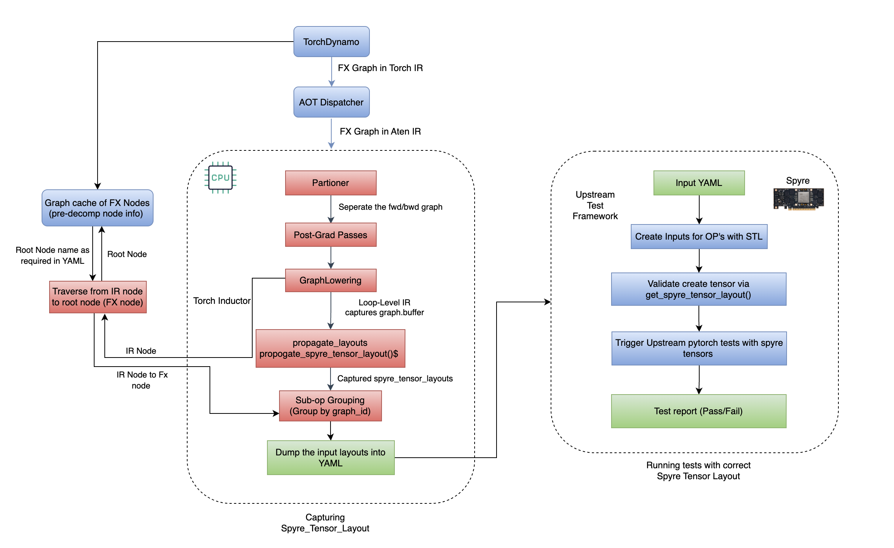
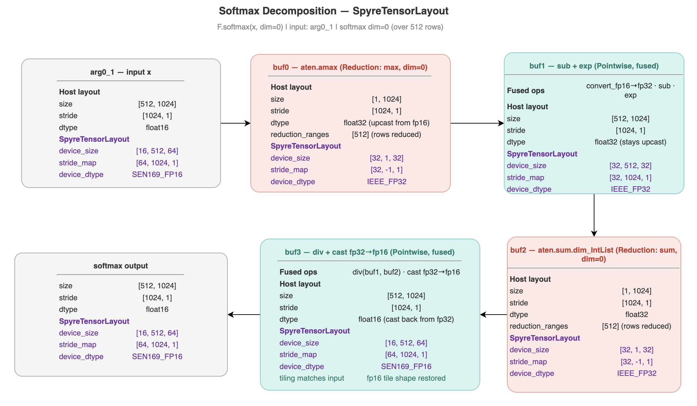

# RFC: SpyreTensorLayout Extraction via CPU Compilation

**Authors:**
- Ganeshi Shreya
- Kanupriya Goyal
- Vishwas R
- Antoni Viros i Martin
- Rishika Kedia
- Saurabh Srivastava
- Goutham Binnadi Gopala
- Ajit Samuel John

**Tracking issue:** https://github.com/torch-spyre/torch-spyre/issues/1069

---

## 1. Summary

This RFC proposes an approach to capture spyre_tensor_layouts for each operation in a PyTorch model by compiling and running the model on the CPU. This method enables us to extract the exact layouts expected on Spyre without needing full operator support on the target backend. By using the CPU as a proxy for Spyre execution, we can efficiently and reliably obtain the required layout information.

---

## 2. Motivation

For model-centric functional verification, validating the correctness of individual PyTorch operations in target models depends on accurately capturing the spyre_tensor_layout associated with each operation. The objective is to obtain the precise SpyreTensorLayouts that would be used during execution on the Spyre device without actually running the model on Spyre hardware.

### Problems

Even if the tensor shape and stride are correct, using an incorrect/default spyre_tensor_layout renders the test case invalid and can introduce multiple false positives. This, in turn, may lead to misleading conclusions about the correctness of the model or the underlying operations.

This enables layout research and model analysis without requiring full backend implementation of Spyre hardware.

---

## 3. Proposed Implementation

### 3.1 Architecture Overview

<p align="center">  </p>

#### Capture Pre-Decomposition Graph

Dynamo calls a custom backend hooked to intercept the pre-decomposition FX graph. For every `call_function`, `call_method`, and `call_module` node in the FX graph it captures operation names, metadata, execution order, and etc. The captured information is accumulated in `pre_node_info` for later use in the grouping step.

```python
def dynamo_backend(gm, example_inputs):
    cur_pre_graph_id[0] = id(gm.graph)
    try:
        for node in gm.graph.nodes:
            if node.op not in ("call_function", "call_method", "call_module"):
                continue
            op_name = get_op_name(node, graph_module=gm)
            if op_name is None: continue
            key = pre_node_key(node)
            if key not in pre_node_info:
                pre_node_info[key] = {
                    "op"         : op_name,
                    "description": get_description(node),
                    "nn_module"  : get_nn_module(node),
                    "node"       : node,
                }
                pre_node_order[key] = order_counter[0]
                order_counter[0] += 1
    except (AttributeError, KeyError, RuntimeError) as exc:
        log.exception("dynamo_backend error: %s", exc)
    return _orig_compile_fx(gm, example_inputs)
```

Op names are resolved to match the existing YAML format exactly:

- call_function → `torch.fx.node._get_qualified_name(node.target)`
  - `torch._C._nn.linear` → `torch.nn.functional.linear`


- call_method → method-specific map 
  - `expand` → `torch.Tensor.expand`

- call_module → MODULE_CLASS_TO_OP[type(module).__name__]
  - `nn.Embedding` → `torch.nn.functional.embedding`

#### Capture Post-Decomposition Graph

The model is compiled using `torch.compile` with the Inductor backend. The `GraphLowering.run` step is monkey-patched to capture the loop-level IR buffer list and a snapshot of Inductor's official `postToPre` node mapping. 

```python
def patched_gl_run(self, *example_inputs):
    result = original_gl_run(self, *example_inputs)
    snap = dict(inductor_debug._inductor_post_to_pre_grad_nodes.get("postToPre", {}))
    ir_graphs.append({
        "graph"      : self,
        "operations" : list(self.buffers),   # loop-level IR buffers
        "pre_graph_id": cur_pre_graph_id[0],
        "postToPre"  : snap,                 # snapshotted here
    })
    return result

GraphLowering.run = patched_gl_run
```

Each IR object has an `origins` attribute (a set of FX nodes from the post-decomp Aten IR graph) that links it back to the source of the computation.

#### Spyre Tensor Layout Propagation 

Spyre's `propagate_spyre_tensor_layouts` is called on the captured buffer list. Since propagate_layouts is a pure Python graph transformation with no hardware calls, it runs identically on CPU and Spyre given the same input seed layouts. The result is a SpyreTensorLayout on every ComputedBuffer in the graph.

#### IR Node mapping to root node

One high-level PyTorch op (e.g. `F.softmax`, `nn.RMSNorm`) decomposes into multiple loop-level IR buffers. Before grouping, each IR buffer must be mapped back to its originating pre-decomp FX node.

The primary source is Inductor's official `postToPre` node mapping, populated by `create_mapping_pre_post_grad_nodes` when provenance_tracking_level = 1. This maps every post-decomp node name to its pre-decomp counterpart and is snapshotted inside `patched_gl_run`.

When the official mapping has no entry for a given IR node, the from_node walk is used as a fallback. 
The mapping uses the `from_node` chain that `aot_autograd` sets on every post-decomp FX node, a linked list of `NodeSource` objects tracing back to the original pre-decomp graph:

```python
def walk_from_node_to_root(node, max_depth=20):
    """
    Walk node.meta['from_node'] chain to the root pre-decomp FX node.
    from_node can be a NodeSource, list of NodeSources, or None.
    Root node name is deterministic (Dynamo naming) and matches
    the key in _all_pre_node_info.
    """
    current = node
    visited = set()
    depth   = 0
    while depth < max_depth:
        if id(current) in visited: break
        visited.add(id(current))
        if not hasattr(current, "meta"): break

        fn_src = current.meta.get("from_node", None)
        if fn_src is None: break

        if isinstance(fn_src, list):
            if not fn_src: break
            fn_src = fn_src[0]

        if hasattr(fn_src, "node"):
            parent = fn_src.node
            if isinstance(parent, list):
                if not parent: break
                parent = parent[0]
            if hasattr(parent, "node") and not hasattr(parent, "meta"):
                parent = parent.node
        else:
            parent = fn_src

        if parent is current or parent is None: break
        current = parent
        depth  += 1
    return current
```

#### Grouping Loop Level IR Operations to their Parent Node

Multiple IR operations can originate from a single pre-decomposition node. Using the postToPre mapping (primary) and from_node walk (fallback) described above, each IR op is attributed to its root pre-decomp key (name, graph_id) and collected into a group.

### 3.2 Softmax Example Output

<p align="center">  </p>

**Pre-Decomposition Graph**

```
── Graph A: pre-decomposition (3 nodes) ──
class GraphModule(torch.nn.Module):
    def forward(self, L_x_: "f16[512, 1024]"):
        l_x_ = L_x_

        # File: .../softmax_spyre_tensor_layout.py:259
        softmax: "f16[512, 1024]" = torch.nn.functional.softmax(l_x_, dim = 0);  l_x_ = None
        return (softmax,)


[Dynamo backend]  nodes=3  types={'placeholder': 1, 'call_function': 1, 'output': 1}
  total pre_node_info: 1
```

**Post-Decomposition Graph**

```
── Graph B: post-decomposition (9 nodes) ──
class <lambda>(torch.nn.Module):
    def forward(self, arg0_1: "f16[512, 1024]"):
        convert_element_type: "f32[512, 1024]" = torch.ops.prims.convert_element_type.default(arg0_1, torch.float32)
        amax: "f32[1, 1024]" = torch.ops.aten.amax.default(convert_element_type, [0], True)
        sub: "f32[512, 1024]" = torch.ops.aten.sub.Tensor(convert_element_type, amax)
        exp: "f32[512, 1024]" = torch.ops.aten.exp.default(sub)
        sum_1: "f32[1, 1024]" = torch.ops.aten.sum.dim_IntList(exp, [0], True)
        div: "f32[512, 1024]" = torch.ops.aten.div.Tensor(exp, sum_1)
        convert_element_type_1: "f16[512, 1024]" = torch.ops.prims.convert_element_type.default(div, torch.float16)
        return (convert_element_type_1,)
```

**Mapping of OPs**

```
── post-decomposition to pre-decomposition op mapping: 7 entries ──────────────
  convert_element_type           → softmax               (torch.nn.functional.softmax)
  amax                           → softmax               (torch.nn.functional.softmax)
  sub                            → softmax               (torch.nn.functional.softmax)
  exp                            → softmax               (torch.nn.functional.softmax)
  sum_1                          → softmax               (torch.nn.functional.softmax)
  div                            → softmax               (torch.nn.functional.softmax)
  convert_element_type_1         → softmax               (torch.nn.functional.softmax)
```

**Final Output**

```
  op           : <function softmax at 0x7f9683a374c0>
  pre_node     : softmax  target=<function softmax at 0x7f9683a374c0>
  description  : 
  sub_ops      : ['buf0', 'buf1', 'buf2', 'buf3']
  inputs       : 1
    [arg0_1]  size=[512, 1024]  device_size=[16, 512, 64]  stride_map=[64, 1024, 1]
  output:
    size        : [512, 1024]
    dtype       : torch.float16
    device_size : [16, 512, 64]
    stride_map  : [64, 1024, 1]
    device_dtype: DataFormats.SEN169_FP16
```

---


## 4. Correctness Verification

To validate the correctness of extracted layouts, we compared them against actual Spyre execution:

### Test Setup:
- Extracted layouts using CPU compilation (method described above)
- Ran the same softmax operation on actual Spyre hardware and extracted the input and output layouts (`torch-spyre/examples/softmax.py`)
- Compared the `SpyreTensorLayouts` from both approaches

### Results:
```
CPU Extraction:
  Device size:  [16, 512, 64]
  Stride map:   [64, 1024, 1]
  Device dtype: float16

Spyre Execution:
  Device size:  [16, 512, 64]
  Stride map:   [64, 1024, 1]
  Device dtype: float16

Layouts match exactly
```

The verification confirms that CPU-based layout extraction produces identical results to actual Spyre hardware execution, validating the correctness of this approach.

---
## 5. Test Execution with YAML-Specified Spyre Tensor Layouts

### 5.1 Overview

Once correct `SpyreTensorLayout` values have been extracted via CPU compilation (Section 3), they can be embedded directly into the test configuration YAML files. This bridges the layout extraction pipeline with the model-centric test framework, enabling deterministic, reproducible test execution with layout-correct tensors on Spyre hardware.

The mechanism eliminates the need for any manual layout guessing or hardware-round-tripping at test time: the YAML file becomes the single source of truth for both tensor shapes and their Spyre device layouts.

### 5.2 YAML Schema Extension: `spyre_layout`

A new optional field `spyre_layout` has been added to `InputTensorSpec` in `tests/oot_test_config_models.py`. When present, it is used by the test runner to transfer the tensor to Spyre using the specified layout instead of the default transfer path.

**Schema:**

```yaml
- tensor:
    shape: [1, 128]
    stride: [128, 1]
    storage_offset: 0
    dtype: torch.float32
    device: cuda:0
    init: rand
    spyre_layout:
      device_size: [4, 1, 32]
      stride_map: [32, -1, 1]
      device_dtype: DataFormats.IEEE_INT32  # optional
```

**Fields:**

| Field | Type | Required | Description |
|---|---|---|---|
| `device_size` | `List[int]` | Yes | Explicit device dimensions after stickification. Must have the same length as `stride_map`. |
| `stride_map` | `List[int]` | Yes | Stride mapping in device space. Use `-1` for broadcast/collapsed dimensions. |
| `device_dtype` | `str` | No | Device data format string (e.g., `DataFormats.IEEE_FP32`, `DataFormats.IEEE_INT32`). Defaults to the format inferred from the tensor `dtype` if omitted. |

**Validation:** At load time, `SpyreTensorLayoutSpec.validate_layout_format` asserts that `len(device_size) == len(stride_map)`. A mismatch raises a `ValueError` immediately, before any test runs.

---

### 5.3 Design: `SpyreTensorLayoutSpec` and `InputTensorSpec.to_spyre()`

Two new components in `oot_test_config_models.py` implement the layout-aware transfer path:

**`SpyreTensorLayoutSpec` (Pydantic model):**

```python
class SpyreTensorLayoutSpec(BaseModel):
    device_size: List[int]
    stride_map: List[int]
    device_dtype: Optional[str] = None

    @model_validator(mode="after")
    def validate_layout_format(self) -> "SpyreTensorLayoutSpec":
        if len(self.device_size) != len(self.stride_map):
            raise ValueError(
                f"device_size length ({len(self.device_size)}) must match "
                f"stride_map length ({len(self.stride_map)})"
            )
        return self
```

**`InputTensorSpec.to_spyre(cpu_tensor)`:**

This method is invoked at test time when a `spyre_layout` is present. It performs the following steps:

1. **Parse `device_dtype`:** Resolves strings like `"DataFormats.IEEE_FP32"` to the actual `DataFormats` enum member by stripping the prefix and using `getattr`.
2. **Construct `SpyreTensorLayout`:** Instantiates with `device_size`, `stride_map`, and optionally `device_dtype`.
3. **Transfer to device:** Calls `cpu_tensor.to("spyre")`.
4. **Apply layout:** Calls `set_spyre_tensor_layout(spyre_tensor, stl)` to override the default layout assigned during transfer.
5. **Validate:** Reads back the layout via `get_spyre_tensor_layout(spyre_tensor)` and asserts that `device_size` and `stride_map` exactly match the specification. Any mismatch raises an `AssertionError` with a descriptive message.

```python
def to_spyre(self, cpu_tensor: torch.Tensor) -> torch.Tensor:
    from torch_spyre._C import SpyreTensorLayout, DataFormats, set_spyre_tensor_layout, get_spyre_tensor_layout
    layout_spec = self.spyre_layout
    if layout_spec is None:
        return cpu_tensor.to("spyre")

    device_size = layout_spec.device_size
    stride_map  = layout_spec.stride_map

    # Resolve device_dtype string → DataFormats enum
    device_dtype = None
    if layout_spec.device_dtype:
        dtype_str = layout_spec.device_dtype.split(".")[-1]
        device_dtype = getattr(DataFormats, dtype_str, None)

    # Build layout
    stl = SpyreTensorLayout(
        device_size=device_size,
        stride_map=stride_map,
        **({"device_dtype": device_dtype} if device_dtype else {}),
    )

    # Transfer and apply
    spyre_tensor = cpu_tensor.to("spyre")
    set_spyre_tensor_layout(spyre_tensor, stl)

    # Validate
    actual = get_spyre_tensor_layout(spyre_tensor)
    assert list(actual.device_size) == device_size
    assert list(actual.stride_map)  == stride_map

    return spyre_tensor
```

### 5.4 Test Runner Integration: `_to_target_device` in `test_model_ops_v2.py`

The test runner's `_to_target_device` helper has been extended to accept an optional `arg_spec` parameter — the `InputTensorSpec` object corresponding to the argument being transferred. When `arg_spec` carries a `spyre_layout`, the layout-aware path is taken; otherwise the tensor is transferred via the plain `.to(device)` path.

```python
def _to_target_device(x: Any, arg_spec: Optional[Any] = None) -> Any:
    if torch.is_tensor(x):
        if (
            arg_spec is not None
            and hasattr(arg_spec, "tensor")
            and hasattr(arg_spec.tensor, "to_spyre")
            and arg_spec.tensor.spyre_layout is not None
        ):
            return arg_spec.tensor.to_spyre(x)   # layout-aware path
        return x.to(test_device)                  # plain path
    if isinstance(x, list):
        return [t.to(test_device) if torch.is_tensor(t) else t for t in x]
    return x
```

**Per-argument iteration:** The sample input's positional arguments (`input` + `args`) are zipped with the corresponding `ops_item.sample_inputs_func.args` specs so that each tensor is transferred with its own layout spec:

```python
test_args = []
for cpu_arg, spec_arg in zip(
    [cpu_sample.input] + list(cpu_sample.args),
    ops_item.sample_inputs_func.args,
):
    test_args.append(_to_target_device(cpu_arg, spec_arg))

test_sample = SampleInput(
    test_args[0],
    args=tuple(test_args[1:]),
    kwargs={k: _to_target_device(v) for k, v in cpu_sample.kwargs.items()},
)
```

Keyword arguments continue to use the plain transfer path, as they are not currently spec-tracked; this can be extended in future work.

### 5.5 End-to-End Data Flow

```
CPU Compilation Pipeline
        │
        ▼
SpyreTensorLayout extracted
(device_size, stride_map, device_dtype)
        │
        ▼
Embedded in YAML (spyre_layout field)
        │
        ▼
Test runner loads YAML → InputTensorSpec.spyre_layout populated
        │
        ▼
_to_target_device() detects spyre_layout → calls InputTensorSpec.to_spyre()
        │
        ▼
SpyreTensorLayout constructed → cpu_tensor.to("spyre") → set_spyre_tensor_layout()
        │
        ▼
Layout validated via get_spyre_tensor_layout() → AssertionError on mismatch
        │
        ▼
Layout-correct Spyre tensor passed to op under test
```

### 5.6 Logging and Observability

Both transfer paths emit structured diagnostic output to `stderr` to aid debugging. The `to_spyre()` method logs the full tensor metadata, the constructed layout, and the post-transfer validation result, making it straightforward to trace layout mismatches back to their source.

The `run_test.sh` script has been updated to capture all test output (stdout + stderr) to a per-test log file:

```bash
_LOG_FILE="spyre_test_$(basename "$_base" .py)_.log"
python3 -m pytest "$_base" -s -vv -rA "${_args[@]}" 2>&1 | tee "$_LOG_FILE"
```

---


---

## 6. Alternatives Considered

### Alternative 1: Manual Layout Calculation

**Approach:** For each operation type (pointwise, reduction, matmul, etc.), manually calculate:
- Device size based on stick dimensions
- Dim map based on operation semantics
- Stride map based on memory layout

**Advantages:**
- No dependency on compilation pipeline
- Can be done independently for each operation
- Potentially faster for simple operations

**Disadvantages:**
- **No source of truth:** No way to validate that manually calculated layouts match what Spyre actually uses
- **Error-prone:** Easy to make mistakes in complex layout calculations, especially for operations with multiple reduction dimensions or complex broadcasting rules
- **Maintenance burden:** Must update calculations whenever `propagate_spyre_tensor_layouts` logic changes or new layout optimization strategies are introduced
- **Incomplete coverage:** May miss edge cases or special handling in stickify that only manifest in specific tensor shapes or operation combinations
- **Scalability issues:** As the number of operations grows, maintaining manual calculations becomes increasingly difficult

### Alternative 2: Direct Spyre Hardware Execution

**Approach:** Run models directly on Spyre hardware and extract layouts from actual execution.

**Advantages:**
- Guaranteed correctness (by definition)
- No assumptions about layout propagation

**Disadvantages:**
- **Requires full operator support:** Cannot extract layouts for operations not yet implemented on Spyre

---

## 7. Drawbacks and Limitations

### 7.1 Operation Decomposition Differences

A potential drawback of this approach is that **operation decomposition may differ between Spyre and CPU backends**. Different backends can decompose high-level operations into different sequences of primitive operations.

**Example:**
- CPU backend might decompose `F.layer_norm` into: `mean → variance → normalize → scale → shift`
- Spyre backend might use a fused implementation or different decomposition order

**Why This Is Safe:**

Despite decomposition differences, this approach remains valid for `SpyreTensorLayout` extraction because:

1. **Layout propagation is deterministic:** Given the same input layouts and operation semantics, the stickify algorithm produces the same output layouts regardless of the specific decomposition path
2. **Decomposition doesn't affect operation output:** Different decompositions are mathematically equivalent and produce the same logical tensor shapes and data
3. **Validation confirms correctness:** Our verification shows that CPU-extracted layouts match actual Spyre execution, proving that decomposition differences don't affect layout correctness

### 7.2 Limited to Supported Operations

This approach can only extract layouts for operations that:
- Have Inductor lowering support
- Can be represented in the loop-level IR
- Are supported by the stickify layout propagation algorithm

Operations that bypass Inductor (e.g., custom CUDA kernels) cannot be analyzed using this method.

---

## 8. Future Work

### 8.1 Fake Tensor Mode Integration

To completely eliminate concerns about decomposition differences, future implementations could use a **fake tensor approach**:

**Approach:**
- Use PyTorch's fake tensor mode to trace operations without actual execution
- Apply Spyre-specific decompositions during tracing
- Extract layouts from the Spyre-decomposed graph

**Benefits:**
- Ensures decompositions exactly match Spyre's behavior
- Eliminates any theoretical concerns about backend differences
- Enables layout extraction for operations not yet implemented on CPU

### 8.3 Keyword Argument Layout Specs

The current implementation only propagates `spyre_layout` specs to positional arguments. A future iteration could extend `sample_inputs_func` to also carry specs for keyword arguments, enabling fully layout-correct tests for operations that take tensor kwargs (e.g., `weight`, `bias`).
