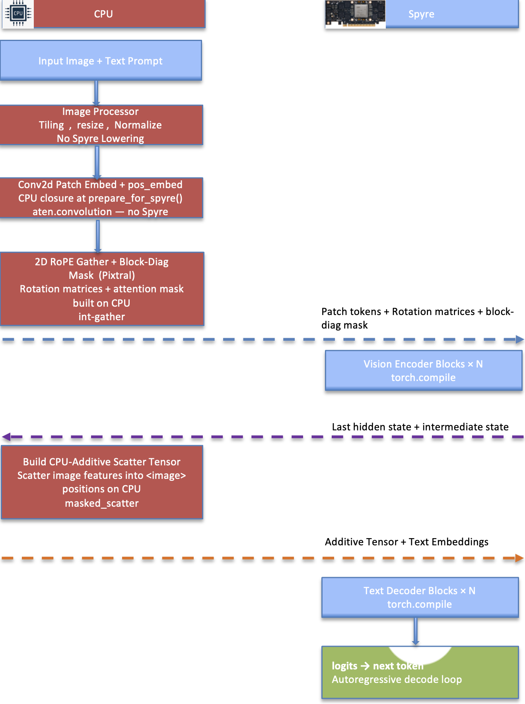

# RFC 1632-ModelEnablement-HfAdapters-v3: Vision Model Enablement in hf-adapters

**Authors:**

- Mohini Shrivastava 
- Ariel Gera
- Benjamin Sznajder
- Assaf Toledo
- Antoni Viros i Martin
- Saurabh Srivastava
- Ajit Samuel John

---

## Summary

This RFC defines the approach for enabling Vision-Language Models (VLMs) on Spyre hardware through the `hf-adapters` framework. It covers:

- How vision towers and combined multimodal pipelines are onboarded via the `hf-adapters` monkey-patch approach
- The two structural patterns for VLMs: **two-tower models** (separate vision encoder + text decoder) and **encoder-free models** (projection-only vision embedding)
- A taxonomy of Spyre-specific adaptations required for vision components
- The testing methodology for vision tower accuracy and end-to-end multimodal correctness
- A CI/CD regression strategy for VLM adapters across CPU, and Spyre tiers
- The labeling system inherited from RFC #1632 v2, extended with vision-specific labels

This RFC builds directly on RFC #1632 v2, which established the label-based model tracking framework and the `hf-adapters` architecture for text models. Vision models add a second tower (or a projection module), require additional Spyre adaptations, and introduce a new class of test (`test_vlm_e2e_cpu.py`, `test_vlm_e2e_spyre.py`) that verifies the full image→text pipeline end-to-end.

---

## Motivation

As the Spyre model portfolio grows beyond text-only causal LMs, vision-language models (VLMs) represent the next major category of customer-relevant workloads. Use cases include document understanding, image captioning, visual question answering (VQA), chart and diagram interpretation, and multimodal reasoning. Each of these requires running both a **vision encoder** (or projection) and a **text decoder** on Spyre hardware, with features exchanged between them.

Enabling VLMs on Spyre is substantially more complex than enabling text models:

1. **Two compute graphs instead of one.** A two-tower VLM compiles two separate `torch.compile` graphs — one for the vision tower (e.g., SigLIP, Pixtral), one for the text decoder (Granite, Mistral, Gemma). Each has its own Spyre incompatibilities to work around.
2. **Heterogeneous compute: some ops on CPU, some on Spyre.** Certain vision ops (Conv2d patch embedding, feature projectors, boolean scatter operations) do not lower on the Spyre backend and must run on CPU with their results moved to Spyre. The split between CPU-resident and Spyre-resident computation must be explicitly managed for each VLM.
3. **New shape constraints.** Vision towers introduce non-standard head dimensions (SigLIP: 72, Pixtral: 64), non-stick-aligned MLP intermediate sizes (SigLIP: 4304), variable-length patch sequences (Pixtral: varies by image size), and 2D positional encodings (Pixtral: 2D RoPE via meshgrid). All require specific padding and encoding strategies before compilation.
4. **Multimodal injection patterns.** Projecting vision features into the text embedding stream uses different injection patterns depending on the model family: Granite Vision uses multi-layer **deepstack + spatial** injection across 8 decoder layers; Mistral3 uses a **flat single injection** before layer 0; Gemma 4 uses an **encoder-free** projection. Each pattern requires specific Spyre-safe scatter operations (no `masked_scatter`, no boolean indexing on device).

---

## Background: The hf-adapters Vision Architecture

The `hf-adapters` library enables Spyre inference via runtime monkey-patches on stock HuggingFace Transformers models, requiring no forks or custom model classes. For text models the key patches are: precomputed RoPE rotation matrices, fp16 RMSNorm, padded LM head, and compiled decoder blocks with raw-tensor KV caches. For vision models, these text-decoder patches carry over for the decoder half; the vision tower adds its own set of patches.

### Two Structural Patterns

Currently enabled VLMs fall into two structural patterns:

#### Pattern 1: Two-Tower Models

A separate vision encoder produces patch features, which are projected and injected into the text embedding stream. Two sub-adapters compose: a **vision tower adapter** and a **combined two-tower adapter**.

```
pixel_values
    │
    ▼
Vision Tower (e.g. SigLIP, Pixtral)          compiled on Spyre
    │  patch hidden states
    │  output_hidden_states (for multi-layer injection)
    ▼
Projector(s)                                 CPU — stock modules
    │  image_features [N_img_tokens, text_hidden]
    ▼
Text Embeddings ──► zero <image> slots       elementwise mul (Spyre-safe)
    │
    │  scatter image_features                CPU-built additive tensor
    ▼
Text Decoder (e.g. Granite, Mistral)         compiled on Spyre
    ▼
logits
```


**Verified examples:**
- Granite Vision 4.1 4B (`hf_granite_vision_mm.py`) — SigLIP tower + Granite text decoder + deepstack/spatial multi-layer injection
- Mistral-Small-3.1-24B-Instruct-2503 (`hf_mistral3_vision_mm.py`) — Pixtral tower + Mistral text decoder + flat single injection
- Ministral-3-14B-Instruct-2512 (`hf_mistral3_vision_mm.py`) — Pixtral tower + Ministral3 text decoder (bf16, blocked-FP8 checkpoint)

#### Pattern 2: Encoder-Free Models

There is no vision tower. A projection module maps processor-merged pixel patches directly into the LM embedding space. Only one compiled graph exists (the text decoder); the projection core may itself be compiled.

```
pixel_values [B, P, 48²·3]             (processor pre-merged)
    │   image_position_ids [B, P, 2]
    ▼
VisionEmbedder                          core compiled on Spyre
    │   (LN → Dense → LN → +posemb     position gather on CPU
    │    → pos_norm → RMSNorm → Linear)
    ▼
image_features [valid_patches, hidden]  padding strips on CPU
    │
Text Embeddings ──► scatter             CPU-built additive tensor
    ▼
Text Decoder (Gemma 4)                  compiled on Spyre
    ▼
logits
```


**Verified examples:**
- Gemma 4 12B (`hf_gemma4_mm.py`) — encoder-free projection + Gemma 4 text decoder (bf16, bidirectional vision attention)


---

## Proposed Implementation

### 1. Vision Tower Adapters

Vision tower adapters are standalone sub-adapters that handle only the image encoder. They are imported by the combined two-tower adapters and can also be tested independently.

#### 1.1 Adapter Contract

A vision tower adapter module must expose:

| Export | Signature | Purpose |
|--------|-----------|---------|
| `prepare_for_spyre(model)` | in-place | Apply all Spyre patches to the tower |
| `prefill_vision_tower(model, pixel_values, ...)` | → `last_hidden_state` | Run the prepared tower |

The `prepare_for_spyre` function stashes the following attributes on the model:

| Attribute | Type | Purpose |
|-----------|------|---------|
| `model._spyre_compiled_blocks` | `list[Callable]` | Compiled encoder blocks |
| `model._spyre_patch_embed` | `Callable` | CPU closure for patch embedding |
| `model._spyre_post_layernorm` | `nn.Module` | Final norm (SigLIP) |

Tower-specific attributes (e.g., `_spyre_pixtral_inv_freq`, `_spyre_pixtral_max_width`) are added as needed.

#### 1.2 Spyre Adaptations — SigLIP Tower (`hf_siglip_vision.py`)

SigLIP is a **pre-LN, bidirectional, no-RoPE, no-KV-cache** ViT encoder over a fixed-length patch sequence. It is used as the vision tower in Granite Vision 4.1 and Gemma 3 multimodal checkpoints.

| Adaptation | Reason | Implementation |
|-----------|--------|----------------|
| Head-dim padding 72→128 | `head_dim = 1152/16 = 72`, `D/2 = 36 < 64` (sub-stick); SDPA and reshape require stick-aligned head_dim | `_pad_vision_heads`: zero-pad Q/K/V/O projections; scale held at `1/sqrt(72)` |
| MLP intermediate padding 4304→4352 | `intermediate_size=4304` is not a stick multiple; Spyre compiler aborts on misaligned K dim in `fc2` matmul | `_pad_vision_mlp`: zero-pad `fc1` out-rows/bias + `fc2` in-cols; bit-exact (zero activations × zero weights) |
| Conv2d patch embed on CPU | `aten.convolution` does not lower on Spyre | `_make_patch_embed`: CPU closure captures conv weight/bias + position embedding table at prepare time; runs on CPU, result moved to Spyre |
| Pre-LN compiled block | Bidirectional SDPA, GELU-tanh MLP (no KV cache, no RoPE) | `make_vision_encoder_block` from `hf_common`; `torch.compile(block_forward, dynamic=False)` |

#### 1.3 Spyre Adaptations — Pixtral Tower (`hf_pixtral_vision.py`)

Pixtral is a **pre-LN, bidirectional, 2D-RoPE** ViT encoder over a variable-length patch sequence. It is used as the vision tower in Mistral3 Vision checkpoints.

| Adaptation | Reason | Implementation |
|-----------|--------|----------------|
| Head-dim padding 64→128 | `head_dim = 1024/16 = 64`, `D/2 = 32 < 64`; `apply_rope_matmul` reshapes to `[B, L, H, 2, D/2]` and requires `D/2 ≥ 64` | `_pad_pixtral_heads`: Q/K use `pad_qk_proj_for_rope` (interleaved), V/O use simple padding |
| 2D RoPE via rotation matrices | Stock `rotate_half` slices along `head_dim` — `aten.slice.Tensor` falls back to CPU inside compiled graphs on Spyre | `_build_pixtral_rope_matrices`: index pre-computed `inv_freq` table by 2D mesh-grid position IDs, build `[P, 2, 2, D/2]` rotation matrices, apply via `apply_rope_matmul` |
| Block-diagonal attention mask | Variable sequence length: patches of different images must not cross-attend | `_build_block_attn_mask`: CPU-built additive float16 `[1, 1, T, T]` mask; moved to Spyre |
| Patch sequence stick-padding | When total patches `P` is not a stick multiple, the `P×P` score matmul lowers incorrectly (cos ~0.74 vs CPU) | Right-pad `P` to `ceil(P/64)*64`; pad keys masked in block-diagonal mask; pad rows cropped after blocks |
| Conv2d patch embed on CPU | Same as SigLIP | `_make_patch_embed_fn`: CPU closure snapshots conv weight + `ln_pre` RMSNorm params |
| `PixtralRMSNorm` patch | `patch_rmsnorm` keeps the norm in fp16 on Spyre, float32 on CPU | `patch_rmsnorm(PixtralRMSNorm)` |
| `.contiguous()` after RoPE | Fusing `apply_rope_matmul` directly into the SDPA graph selects a lowering that overflows fp16 to Inf on some blocks | Materialize `q` and `k` buffers with `.contiguous()` to break the fusion |

#### 1.4 Encoder-Free Vision Embedder — Gemma 4 (`hf_gemma4_mm.py`)

Gemma 4 has no vision tower. The `Gemma4UnifiedVisionEmbedder` projects processor-merged pixel patches into the LM embedding space using a stack of dense layers with LayerNorm.

| Adaptation | Reason | Implementation |
|-----------|--------|----------------|
| Core compiled on Spyre | `LN₁→Dense→LN₂→+posemb→pos_norm→RMSNorm→Linear` is a pure dense computation that lowers cleanly | `_make_compiled_vision_core`: `torch.compile(core, dynamic=False)` |
| Position gather on CPU | Integer XY `image_position_ids` + `-1` padding validity mask; integer-gather + boolean indexing don't lower on Spyre | `_build_pos_embs`: CPU gather, returns positional-embedding tensor to be passed as device argument into compiled core |
| Padding-patch strip on CPU | Strip padding patches after projection; boolean indexing on device doesn't lower | Cropping after `core()` on CPU |
| Vision `nn.LayerNorm` patch | The three vision LayerNorms NaN on Spyre's fused lowering on near-constant-variance rows (both bf16 and fp16) — genuine lowering defect, not a range issue | `patch_layernorm`: device-conditional un-fused rewrite with fp32 mean/variance reduction, affine multiply kept in bf16 |
| Bidirectional vision attention | `use_bidirectional_attention == "vision"`: image soft-tokens must attend bidirectionally within an image at prefill | `_blockwise_band`: build OR(causal, blockwise) for full layers; AND(sliding_window, OR(causal, blockwise)) for sliding layers |
| bf16 runtime | Gemma family overflows residual stream in fp16 | `MODEL_PATH_TO_TORCH_DTYPE` registry; all Gemma checkpoints run in bfloat16 |

### 2. Combined Two-Tower Adapter Pattern

Each two-tower adapter composes a vision tower sub-adapter with a text decoder sub-adapter. The combined adapter's `prepare_for_spyre` function calls both sub-adapters' preparation in sequence and must avoid attribute naming collisions.

#### 2.1 Attribute Namespace Convention

| Attribute | Owner | Purpose |
|-----------|-------|---------|
| `model._spyre_compiled_blocks` | Vision tower adapter | Vision encoder compiled blocks |
| `model._spyre_text_blocks` | Combined adapter (text decoder) | Text decoder compiled blocks |
| `model._spyre_rope` | Text decoder preparation | Precomputed text RoPE |
| `model._spyre_patch_embed` | Vision tower adapter | CPU patch-embed closure |
| `model._spyre_post_layernorm` | Vision tower adapter (SigLIP) | Post-encoder LayerNorm |
| `model._spyre_pixtral_*` | Pixtral tower adapter | Pixtral-specific RoPE and config |

The naming convention `_spyre_text_blocks` (instead of `_spyre_compiled_blocks` for the decoder) is **required** in combined adapters to prevent overwriting the vision tower's compiled blocks when `hf_pixtral_vision.prepare_for_spyre` or `hf_siglip_vision.prepare_for_spyre` is called first.

#### 2.2 Injection Patterns

**Deepstack + Spatial Injection (Granite Vision)**

Granite Vision 4.1 uses a multi-layer injection strategy. Several intermediate vision layers are each projected by a separate Blip2-QFormer projector and summed into the image-token positions of a specific text decoder layer (`deepstack_layer_map`). Additionally, a spatial offset group from a single vision layer is projected and injected at 4 further decoder layers (`spatial_target_layers`). This is 8 injection points total.

```
vision_hidden_states (output_hidden_states=True)
    │ [vision_layer_idx → projected_features → text_layer_idx]
    ▼ deepstack_layer_map + spatial_target_layers
deepstack dict: {text_layer: features}
    │
    ▼ _inject_deepstack (before each mapped text decoder block)
h_i ← h_i + scatter(features, image_token_positions)
```

Spyre-safe injection: `masked_scatter`, boolean indexing, and on-device `mask.sum()` do not lower on Spyre. The injection is implemented as `h + additive`, where `additive` is built on CPU (features scattered into image-token positions, zero elsewhere) and moved to the hidden state's device.

**Flat Single Injection (Mistral3)**

Mistral3 injects once, before decoder layer 0. The `multi_modal_projector` (RMSNorm + `Mistral3PatchMerger` + two linear layers) runs on CPU, producing `image_features [N_img_tokens, text_hidden]`. These are scattered into the `<image>` token slots of the text embeddings using the same CPU-additive-tensor technique.

Note: `Mistral3PatchMerger` uses `nn.functional.unfold`, which does not lower on Spyre. Pinning `multi_modal_projector` to CPU after `_move_to_spyre_with_layout` is required.

**Encoder-Free Scatter (Gemma 4)**

No tower, no projector call-chain. After the vision embedder projects all patches, the results are scattered directly into the `<image>` token slots of the scaled word embeddings. Image-token slots are zeroed with `* keep` (elementwise multiply, not `masked_fill_`).

#### 2.3 Image-Slot Zeroing Convention

Before injecting vision features, image-token positions in the text embedding stream are zeroed. `masked_fill_` does not lower on Spyre. The Spyre-safe pattern across all adapters is:

```python
vision_mask = (input_ids == model.config.image_token_id).unsqueeze(-1)
keep = (~vision_mask).to(dtype).to(inputs_embeds.device)
inputs_embeds = inputs_embeds * keep
```

The `~` (boolean NOT) and `.to(dtype)` conversion are computed on CPU; only the final elementwise multiply runs on Spyre.

### 3. Model Registry Extension

All tracked vision models are stored in [`tests/model_registry.py`](../hf-adapters/tests/model_registry.py:354) under `VISION_MODELS`. Each entry carries:

| Field | Required | Description |
|-------|----------|-------------|
| `name` | Yes | Human-readable display name |
| `path` | Yes | HuggingFace model ID (primary key) |
| `adapter` | Yes | Adapter module filename |
| `kind` | Yes | `"tower"` (vision tower only) or `"vlm"` (full image→text) |
| `size` | No | Parameter count (used by representative-model selection) |
| `dtype` | No | Override dtype if fp16 is wrong (e.g., `"bfloat16"` for Gemma family) |

The `kind` field determines which test files parametrize on the entry:
- `"tower"` → `test_adapter_cpu_accuracy.py` (tower accuracy vs stock HF extraction)
- `"vlm"` → `test_vlm_e2e_cpu.py` and `test_vlm_e2e_spyre.py` (full image→text generate)

### 4. Label System (Extended from RFC #1632 v2)

Vision models carry the same binary status labels defined in RFC #1632 v2, plus two vision-specific labels:

| Label | Description |
|-------|-------------|
| **has adapter** | A combined two-tower adapter (or encoder-free adapter) is registered in `IMAGE_TEXT_TO_TEXT_CONFIG_TO_ADAPTER_MODULE_MAPPING`. |
| **tower verified on cpu** | The vision tower (or projection core) produces output with cosine similarity ≥ 0.999 vs. stock HF on CPU. Verified by `test_adapter_cpu_accuracy.py` using `load_hf_model()` to extract the bare tower from the multimodal checkpoint. |
| **vlm verified on cpu** | The full two-tower `generate` matches stock `AutoModelForImageTextToText.generate` token-for-token on CPU. Verified by `test_vlm_e2e_cpu.py`. |
| **vlm verified on spyre** | On Spyre hardware, the adapter's teacher-forced step-by-step logits have cosine similarity ≥ 0.999 vs. the CPU reference over prefill + decode steps. Verified by `test_vlm_e2e_spyre.py`. |
| **runnable on spyre** | Both towers (or the encoder-free projection + text decoder) load and execute on Spyre hardware without error. |

A vision model may hold any combination of these labels. The minimal path to production-readiness is: **has adapter** → **tower verified on cpu** → **vlm verified on cpu** → **vlm verified on spyre**.

### 5. Testing Methodology

#### 5.1 End-to-End VLM Accuracy Test (CPU)

Tests the full image→text pipeline: processor → adapter `generate` → decoded text. Compared against stock `AutoModelForImageTextToText.generate` (token-for-token).

```python
# tests/cpu/test_vlm_e2e_cpu.py
# processor.apply_chat_template + real hub image (pipeline-cat-chonk.jpeg)
# adapter.generate(model, processor, input_ids, attention_mask, pixel_values, ...)
# assert adapter_text[0] == ref_text  (token-exact)
```

A real, recognizable hub image (a chonky cat from `huggingface/documentation-images`) is used so the generated caption is human-eyeballable as a secondary quality signal.

Extra multimodal inputs beyond the standard three (`input_ids`, `attention_mask`, `pixel_values`) are forwarded by keyword via `extra_image_inputs(fn, batch)`, which inspects the adapter's `generate` signature — keeping the test harness signature-agnostic across VLM families (e.g., `image_sizes` for Granite Vision / Mistral3, `image_position_ids` + `mm_token_type_ids` for Gemma 4).

#### 5.2 End-to-End VLM Accuracy Test (Spyre)

Tests the full pipeline on Spyre hardware using a **teacher-forced** approach. Stock generates tokens on CPU; the Spyre adapter is driven step-by-step using those same tokens, and per-step logit cosine similarity is asserted.

```
stock_generate → [t1, t2, ..., tN]          CPU reference
                 ↓  at each step i
spyre_step_i(input_ids[:i]) → logits_i      Spyre
                 ↓
cosine(logits_i_spyre, logits_i_cpu) ≥ 0.999   (asserted)
top-1 match reported (not asserted — ties possible in fp16)
```

This teacher-forcing strategy is preferred over free-run generation because:
1. fp16 near-ties can cause token divergence on any step without indicating a real accuracy problem
2. It directly isolates the Spyre adapter's logit accuracy from the token selection policy
3. It gives a per-step cosine signal across the full decode, catching errors that accumulate across layers

**Verified accuracy thresholds (current):**
- Granite Vision 4.1 4B: cosine ≥ 0.99991 at every prefill + decode step
- Gemma 4 12B (bf16): cosine ≥ 0.99964 at every step, 5/5 top-1 agreement

### 6. Adapter Registration

Two registration points in [`hf_adapters/auto_spyre_model.py`](../hf-adapters/hf_adapters/auto_spyre_model.py):

**Text-only path** — `CONFIG_TO_ADAPTER_MODULE_MAPPING`: maps the VLM's config class to the **text-only** adapter (e.g., `Granite4VisionConfig → hf_granite_vision`). Used by `AutoSpyreModelForCausalLM`, which loads only the text backbone, dropping the vision tower.

**Multimodal path** — `IMAGE_TEXT_TO_TEXT_CONFIG_TO_ADAPTER_MODULE_MAPPING`: maps the same config class to the **combined two-tower** adapter (e.g., `Granite4VisionConfig → hf_granite_vision_mm`). Used by `AutoSpyreModelForImageTextToText`, which loads the full VLM.

This dual-registration pattern means a VLM checkpoint can be used either as a text-only LM (lightweight, faster to load) or as a full VLM (both towers, heavier, full image→text capability) via the appropriate auto class.

### 7. Onboarding a New Vision Model

The onboarding path for a new VLM follows these steps:

#### Step 1: Identify the VLM structural pattern

Determine whether the model follows Pattern 1 (two-tower: vision encoder + text decoder) or Pattern 2 (encoder-free: projection only). Check the model card and `AutoConfig.from_pretrained(model_path)`.

#### Step 2: Check the vision tower architecture

For two-tower models, identify the vision tower type and its Spyre constraints:

```python
from transformers import AutoConfig
cfg = AutoConfig.from_pretrained(model_path)
vcfg = cfg.vision_config
head_dim = vcfg.hidden_size // vcfg.num_attention_heads
inter = vcfg.intermediate_size
print(f"head_dim={head_dim}, head_dim/2={head_dim//2}, intermediate_size={inter}")
print(f"head_dim/2 stick-aligned: {(head_dim//2) % 64 == 0}")
print(f"intermediate stick-aligned: {inter % 64 == 0}")
```

Apply the corresponding padding adaptations (head-dim padding, MLP padding) following the patterns in `hf_siglip_vision.py` and `hf_pixtral_vision.py`.

#### Step 3: Check if an existing text decoder adapter covers the text backbone

Many new VLMs reuse existing text decoder architectures. Check `CONFIG_TO_ADAPTER_MODULE_MAPPING` for the `text_config.model_type`. If a text adapter already exists, the combined adapter only needs to:
1. Prepare the vision tower
2. Call the existing text adapter's `prepare_for_spyre` logic (or the shared `prepare_rope_and_heads` / `_make_compiled_block` helpers)
3. Implement the image-feature injection pattern for this model family

#### Step 4: Create the vision tower adapter module

Create `hf_adapters/hf_<vision_tower>.py` if the tower architecture is new. The module must expose `prepare_for_spyre(model)` and `prefill_vision_tower(model, pixel_values, ...)`.

#### Step 5: Create the combined two-tower adapter module

Create `hf_adapters/hf_<model_family>_mm.py`. The module must expose `prepare_for_spyre(model)`, `prefill_logits(...)`, and `generate(...)`.

#### Step 6: Register in both auto-loader mappings

Add entries to `CONFIG_TO_ADAPTER_MODULE_MAPPING` (text-only) and `IMAGE_TEXT_TO_TEXT_CONFIG_TO_ADAPTER_MODULE_MAPPING` (multimodal) in `hf_adapters/auto_spyre_model.py`.

#### Step 7: Register in the model registry

Add entries to `VISION_MODELS` in `tests/model_registry.py` — one `"tower"` entry for the bare vision tower test and one `"vlm"` entry for the full end-to-end test.

#### Step 8: Run the test suite

```bash
# Vision tower accuracy (CPU)
uv run pytest tests/cpu/test_adapter_cpu_accuracy.py -k <tower_key>

# Full VLM generate (CPU, token-exact vs stock)
uv run pytest tests/cpu/test_vlm_e2e_cpu.py -k <vlm_key>

# Spyre hardware (teacher-forced cosine, requires Spyre pod)
uv run pytest tests/spyre/test_vlm_e2e_spyre.py -k <vlm_key>
```

#### Step 9: Update ARCHITECTURE.md

Add the model to the **Vision-Language (image→text)** Verified Checkpoints table and the **Model Family Coverage** table. Bump the coverage counters.

### 8. CI/CD Regression Testing

Vision models participate in the same three-tier CI/CD structure defined in RFC #1632 v2, with the following vision-specific scope:

#### PR-Level Tests

- **Trigger:** every pull request
- **Scope:** 1 representative VLM (currently: Granite Vision 4.1 4B as the smallest verified VLM)
- **Test type:** CPU-only VLM generate test (`test_vlm_e2e_cpu.py`)
- **Purpose:** fast signal that the vision pipeline (tower + injection + text decoder) generates correctly after code changes
- **Constraint:** must complete within PR gate time budget; CPU-only avoids Spyre pod dependency at PR time

#### Nightly Tests

- **Trigger:** every night (scheduled)
- **Scope:** one representative VLM per adapter family (`hf_granite_vision_mm`, `hf_mistral3_vision_mm`, `hf_gemma4_mm`)
- **Test type:** CPU VLM generate test + Spyre tower accuracy test
- **Purpose:** daily confidence that each VLM adapter family functions correctly after any upstream dependency (transformers, torch-spyre) updates

#### Weekly Tests

- **Trigger:** every weekend (scheduled)
- **Scope:** all models with `vlm verified on spyre` label
- **Test type:** full end-to-end Spyre teacher-forced accuracy test (`test_vlm_e2e_spyre.py`) for each verified VLM
- **Purpose:** comprehensive regression check across all verified VLMs; catches any accuracy drift introduced by torch-spyre compiler changes

---

## Current Status (at RFC submission time)

### Verified Vision-Language Checkpoints

| Model | model_type | Vision Tower | Injection Pattern | CPU Accurate | Spyre Compiles | Spyre Runs |
|-------|-----------|-------------|-------------------|-------------|---------------|-----------|
| Granite Vision 4.1 4B | granite4_vision | SigLIP (pre-LN, no RoPE) | Deepstack + Spatial (8 points) | Yes | Yes | Yes |
| Mistral-Small-3.1-24B-Instruct-2503 | mistral3 | Pixtral (pre-LN, 2D RoPE) | Flat single (layer 0) | Yes | Yes | Yes |
| Ministral-3-14B-Instruct-2512 | mistral3 | Pixtral (pre-LN, 2D RoPE) | Flat single (layer 0) | Yes (bf16) | Yes | Yes |
| Gemma 4 12B | gemma4_unified | Encoder-free projection | Scatter into <image> slots | Yes (bf16) | Yes | Yes |

**CPU Accurate** = adapter `generate` matches stock `model.generate` token-for-token on CPU (`test_vlm_e2e_cpu.py`).
**Spyre Runs** = `test_vlm_e2e_spyre.py` step-by-step logit cosine ≥ 0.999 vs CPU reference.

### Verified Vision Tower Components

| Tower | Used in | head_dim | MLP intermediate | Padded | CPU Accurate | Spyre Runs |
|-------|---------|---------|-----------------|--------|-------------|-----------|
| SigLIP (`hf_siglip_vision.py`) | Granite Vision 4.1, Gemma 3 (text-only) | 72→128 | 4304→4352 | Yes | Yes | Yes |
| Pixtral (`hf_pixtral_vision.py`) | Mistral-Small-3.1, Ministral-3-14B | 64→128 | 4096 (aligned) | Yes (head only) | Yes | Yes |

### Adapter Coverage

| Adapter | Config type | Text decoder | Vision component | Verified checkpoints |
|---------|------------|-------------|-----------------|---------------------|
| `hf_siglip_vision.py` | — (tower-only sub-adapter) | — | SigLIP ViT encoder | 1 (Granite Vision 4.1 tower) |
| `hf_pixtral_vision.py` | — (tower-only sub-adapter) | — | Pixtral ViT encoder | 1 (Mistral-Small-3.1 tower) |
| `hf_granite_vision_mm.py` | Granite4VisionConfig | Granite (via `hf_granite`) | SigLIP + deepstack | 1 |
| `hf_mistral3_vision_mm.py` | Mistral3Config | Mistral/Ministral3 (via `hf_mistral3`) | Pixtral + flat inject | 2 |
| `hf_gemma4_mm.py` | Gemma4UnifiedConfig | Gemma 4 (via `hf_gemma4`) | Encoder-free projection | 1 |

---

## Metrics

- Number of VLMs with `vlm verified on spyre` label (target: grows over time)
- Number of distinct vision tower architectures supported
- VLM regression test pass rate per CI tier (PR / nightly / weekly)
- Per-step cosine similarity on Spyre vs CPU (tracked per model; threshold ≥ 0.999)
- Trend of `vlm verified on spyre` model count over time

---

## Drawbacks

- **Memory pressure.** VLMs are larger than text-only models: Granite Vision 4.1 requires loading the SigLIP tower (~400M params) in addition to the Granite text decoder. Models at the upper limit of Spyre's memory budget may not be feasible.
- **CPU–Spyre data movement overhead.** Ops that cannot lower on Spyre (Conv2d, boolean scatter, projectors) run on CPU. For large images with many patches, the CPU→Spyre transfer for patch embeddings may become a latency bottleneck.
- **Recompilation on image-size change.** Pixtral's variable-length patch sequences (P varies by image size and resolution) change the compiled graph's sequence length. Static `torch.compile(dynamic=False)` compiles a new graph for each distinct `P` value encountered. For applications with varied image sizes this can introduce compilation overhead.
- **Deepstack projectors add non-trivial CPU latency.** Granite Vision 4.1's 8 Blip2-QFormer projector calls (4 deepstack + 4 spatial) run on CPU. The QFormer attention is sequential and not compiled; at high batch or with many image tokens this adds measurable latency.
- **bf16-only Gemma family.** Gemma 3 / Gemma 4 / EmbeddingGemma require bf16 (fp16 overflows the residual stream). Spyre's bf16 support is a prerequisite for these models; any platform that does not support bf16 cannot run them.
- **No streaming generation for VLMs.** The current generate loop buffers all tokens and returns strings at the end. Streaming token-by-token delivery is not yet supported for either text or VLM adapters, and the VLM's prefill (vision tower + injection) adds per-request latency before the first token.

---

## Alternatives

### Alternative 1: vLLM-based vision enablement

Run VLMs through the vLLM Spyre plugin rather than through `hf-adapters`. vLLM has native multimodal support (`LlavaForCausalLM`, `Qwen2VLForCausalLM`, etc.) and an established multimodal model runner.

**Tradeoff:** vLLM's multimodal runner adds significant complexity (prefill splitter, image feature cache, chunked prefill). Its compiled graphs are harder to debug and the dependency footprint is heavier. The `hf-adapters` approach trades this complexity for a simpler, more transparent adapter that directly patches the HF model. For the scale of models currently targeted (4B–24B VLMs, single-device), `hf-adapters` has lower operational overhead.


### Alternative 2: Online image pre-processing on Spyre

Run the processor's image tiling and patch extraction on Spyre rather than on CPU.

**Tradeoff:** The processor uses PIL, torchvision, and numpy operations that have no Spyre lowering. Moving this work to Spyre would require porting significant preprocessing code. The current CPU-based preprocessing is fast enough for batch inference and avoids a complex porting effort.

---

## References

- **RFC #1632 v1** : established the motivation for Spyre model enablement tracking, recommended vLLM-based tracing, and proposed ops/modules percentage metrics.
- **RFC #1632 v2** : defined the label-based tracking framework, the `hf-adapters` monkey-patch approach, model registry (`models.csv`), reference output storage, and the three-tier CI/CD structure. This RFC is a direct extension of that framework to vision models.
- **`hf-adapters` repository**: the implementation this RFC formalizes for VLMs. See [`ARCHITECTURE.md`](../hf-adapters/ARCHITECTURE.md) (Multimodal VLM Path section), [`hf_siglip_vision.py`](../hf-adapters/hf_adapters/hf_siglip_vision.py), [`hf_pixtral_vision.py`](../hf-adapters/hf_adapters/hf_pixtral_vision.py), [`hf_granite_vision_mm.py`](../hf-adapters/hf_adapters/hf_granite_vision_mm.py), [`hf_mistral3_vision_mm.py`](../hf-adapters/hf_adapters/hf_mistral3_vision_mm.py), [`hf_gemma4_mm.py`](../hf-adapters/hf_adapters/hf_gemma4_mm.py).
- **SigLIP (Zhai et al., 2023)**: the vision transformer backbone used by Granite Vision 4.1 and the Gemma 3 family. Pre-LN ViT trained with a sigmoid-based pairwise loss.
- **Pixtral (Mistral AI, 2024)**: the vision tower in Mistral3 VLMs. Variable-resolution ViT with 2D RoPE and SwiGLU MLP.

---

## How We Teach This

- The `"tower"` / `"vlm"` `kind` field in `VISION_MODELS` provides a clear vocabulary for distinguishing bare tower tests (verify the encoder alone) from full VLM tests (verify the image→text pipeline end-to-end).
- The two registration points (`CONFIG_TO_ADAPTER_MODULE_MAPPING` for text-only, `IMAGE_TEXT_TO_TEXT_CONFIG_TO_ADAPTER_MODULE_MAPPING` for multimodal) map cleanly to the two auto classes (`AutoSpyreModelForCausalLM` for text, `AutoSpyreModelForImageTextToText` for image→text). The pattern is self-documenting: the class name communicates the capability.
- The `prepare_for_spyre` convention is unchanged from text adapters. New contributors familiar with text adapter onboarding can follow the same mental model for VLMs, with the additional step of preparing the vision tower.
- The `extra_image_inputs(fn, batch)` helper in `tests/_vision_helpers.py` keeps the test harness signature-agnostic; contributors don't need to update the test file when adding a new VLM with different processor outputs.
- The CPU-vs-Spyre split is made explicit in each vision adapter's docstring, which lists which operations run on CPU and which run on Spyre.

---

## Unresolved Questions

- **Quality evaluation for VLMs.** The current accuracy tests verify that the adapter's logits match stock HF logits. They do not assess visual understanding quality (e.g., VQA accuracy on MME or MMMU). Should a periodic quality eval for VLMs be added to the testing framework?

- **CPU–Spyre transfer overhead for large images.** Conv2d patch embeddings and projector outputs are transferred from CPU to Spyre on every request. For large images with many patches (Pixtral at high resolution), the transfer volume grows proportionally. At what image size does the CPU→Spyre transfer become the dominant latency in the vision prefill, and should patch embeddings be cached across requests for identical image inputs?

---

## Resolution

*TBD*

### Level of Support

*TBD*

#### Additional Context

*TBD*

### Next Steps

*TBD*

#### Tracking Issue

*TBD*

#### Exceptions

*TBD*
