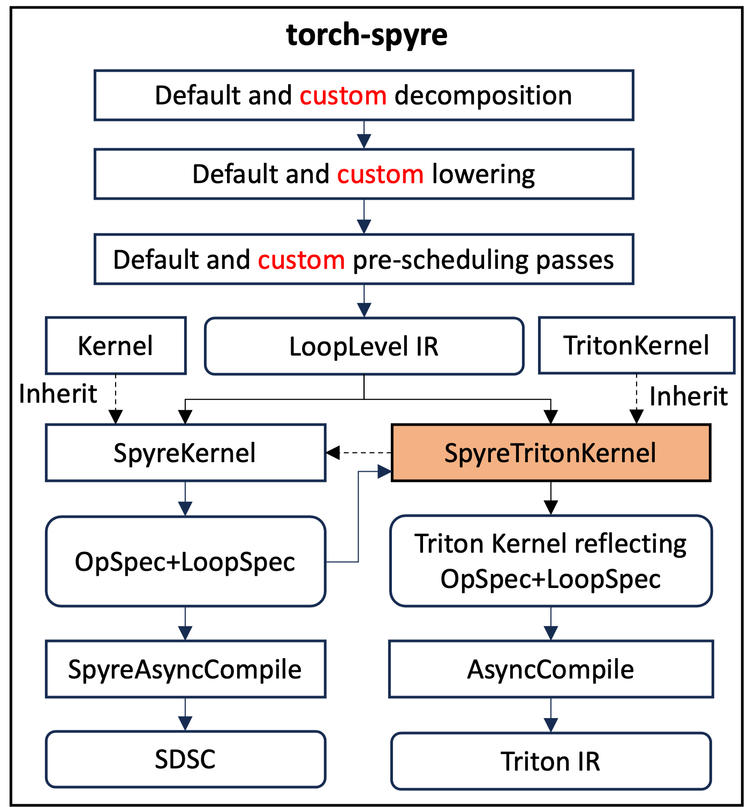

# Reflecting OpSpec/LoopSpec to Triton Kernels

**Authors:**
* @tnakaike
* @moriohara
* @kiszk
* @airin711
* @mudhakar
* @raghukiran1224
* @fabianlim
* @lchu6

## **Summary**

`SpyreTritonKernel` generates layout-aware Triton code directly from `OpSpec` and `LoopSpec` metadata, so the emitted Triton source already reflects Spyre's tiled physical layout. It inherits from upstream `TritonKernel` for IR generation and emits `tl.make_tensor_descriptor` calls that encode the N-dimensional device layout, producing truly multi-dimensional memory accesses at Python-level code generation time.

## **Motivation**

Spyre stores tensors in a **tiled physical layout** that differs from the flat row-major layout assumed by upstream Triton. Each fp16 tensor is stored in 128-byte *sticks* (64 elements per stick), and the hardware addresses memory through a multi-dimensional device coordinate system (e.g., `[sticks, rows, intra-stick]`).

Standard Triton kernels use `tl.load` / `tl.store` with 1D flat pointer arithmetic — they assume that element `[i, j]` of a `[M, N]` tensor lives at offset `i * N + j`. This does not match Spyre's tiled memory layout. Without layout-aware code generation, every Triton kernel would have to be retrofitted further down the toolchain to translate flat accesses into multi-dimensional tensor descriptor operations.

Generating layout-aware Triton code directly:
- Makes the device layout visible in the emitted Triton source, easing debugging and inspection.
- Allows TorchInductor's existing fusion and scheduling infrastructure to work unchanged on Spyre, while still respecting the physical tile geometry of the device.

## **Proposed Implementation**

### Design Overview

`SpyreTritonKernel` inherits from `TritonKernel` (to generate Triton IR) and calls `SpyreKernel` functions to create `OpSpec` and `LoopSpec` metadata. It then emits `tl.make_tensor_descriptor` calls that encode the N-dimensional device layout, producing multi-dimensional memory accesses.

<p align="center">
  
</p>
<p align="center">
  Figure 1. <code>SpyreTritonKernel</code> inherits from <code>TritonKernel</code> and calls <code>SpyreKernel</code> functions to obtain <code>OpSpec</code> / <code>LoopSpec</code> metadata.
</p>

The kernel generation involves three key computations:

1. **Compute the device shape (`block_shape`) from `device_size`, `iteration_space`, and `LoopSpec`** — `tl.make_tensor_descriptor` requires a `block_shape` that reflects the per-program tile geometry. This shape is derived from `device_size` (the full device-space tensor shape) by dividing each device dimension by the core divisor from `iteration_space`, and then further dividing by any active `LoopSpec.count` for symbols that are tiled by a coarse-tiling loop.

2. **Compute offsets into the device shape from `iteration_space` and `LoopSpec`** — The flat Triton iteration index is decomposed into per-dimension scalar starting offsets using `IterationRangesEntry` expressions from `iteration_space`. These original-space offsets are substituted into the `device_coordinates` expressions to produce one device-space offset per device dimension. When a `LoopSpec` is active, the offsets for tiled symbols advance by `(total / core_div) / loop_count` elements per iteration.

3. **Generate a tiling loop from `LoopSpec`** — When a `LoopSpec` wraps `OpSpec` entries, the kernel emits an explicit `for` loop whose trip count is `LoopSpec.count`. Each iteration recomputes the device offsets for tiled symbols based on the loop variable. Tensor descriptors whose `shape`, `strides`, and `block_shape` are loop-invariant are hoisted outside the loop; only the offset arguments to `load_tensor_descriptor`/`store_tensor_descriptor` change per iteration.

<p align="center">
  
</p>
<p align="center">
  Figure 2. The three-stage kernel generation pipeline: map the flat Triton iteration space to OpSpec symbols, obtain device layout metadata, and emit a Triton kernel with <code>tl.make_tensor_descriptor</code> calls.
</p>

### SpyreTritonKernel Implementation

#### The Three-Level Dimension Mapping

The core algorithm performs a three-level dimension mapping:

```
Level 1 (Triton shape)   — flat ≤3D index from Triton's iteration space
Level 2 (Original shape) — per-original-dim offsets from iteration_space
Level 3 (Device shape)   — device_size from SpyreTensorLayout
```

##### Level 1 → Level 2: Scalar Starting Offsets

`TritonKernel` already decomposes the flat iteration index into per-dimension entries in its preamble:

```python
xoffset = tl.program_id(0) * XBLOCK          # scalar — this program's base
xindex  = xoffset + tl.arange(0, XBLOCK)     # vector — all elements
x0      = xindex % S1                         # vector — c1 index
x1      = xindex // S1                        # vector — c0 index
```

`SpyreTritonKernel` reuses these `IterationRangesEntry` expressions but substitutes the **scalar** `xoffset` for the vectorized `xindex` to obtain scalar starting offsets for each original dimension:

```python
d1 = xoffset % S1    # scalar start of c1 for this program
d0 = xoffset // S1   # scalar start of c0 for this program
```

This is valid because `xoffset = pid * XBLOCK` is always a multiple of each per-dim tile size. The decomposition structure (moduli, divisors) is read directly from the existing `IterationRangesEntry.expr` objects.

For reduction dimensions, the same substitution applies using the scalar loop variable `r0_offset` in place of the vectorized `rindex`.

##### Level 2 → Level 3: Device Coordinate Evaluation

`device_coordinates` from `TensorArg` provides one sympy expression per device dimension. Substitute the Level-2 offsets to obtain device-space offsets:

```python
device_offsets[k] = device_coordinates[k].subs({c0: d0, c1: d1, ...})
```

For example, with `device_coordinates = [floor(c1/64), c0, c1 % 64]`:

```python
off0 = d1 // 64    # device dim 0: stick index
off1 = d0          # device dim 1: row
off2 = d1 % 64     # device dim 2: intra-stick offset
```

##### Level 3: Emit Tensor Descriptors

The computed offsets, `device_size`, and row-major strides are used to create an N-D tensor descriptor:

```python
desc = tl.make_tensor_descriptor(
    base_ptr,
    shape=device_size,                      # e.g. [4, 128, 64]
    strides=row_major_strides(device_size), # e.g. [8192, 64, 1]
    block_shape=per_loop_block_shape,       # e.g. [4, 4, 64]
)
val = tl.load_tensor_descriptor(desc, device_offsets)
```

#### Triton-to-OpSpec Dimension Mapping

The `triton_opspec_map` establishes which Triton iteration-space prefixes (`x`, `y`, `z`, `r0_`, ...) correspond to which OpSpec symbols (`c0`, `c1`, ...). This mapping is needed because Triton may flatten multiple OpSpec dimensions into a single prefix.

Two strategies are supported. The **index-coefficient method** is simple and covers the common case; the **construction-time hook** is the structural fix for shapes the coefficient method cannot disambiguate.

##### Index-coefficient method (simple, default for current op coverage)

Both the Triton index and OpSpec index are linear expressions over the same tensor layout. For a tensor with distinct strides, each dimension has a unique coefficient (= tensor stride), so matching by coefficient directly establishes the structural correspondence:

```python
opspec_index.coeff(c_i) == triton_index.coeff(triton_sym_j)
  ⟹  c_i and triton_sym_j address the same dimension
```

This approach is robust across:

- **1D spatial tiling** (single `x` covering all dims)
- **Multi-dimensional spatial tiling** (`{y: s0, x: s1}`)
- **Batched matmul** (`{z: B, y: M, x: N, r0_: K}`)

It relies on three properties holding for the kernel's tensors: (i) all iterated dimensions have distinct, non-zero strides, (ii) length-1 ranges have been simplified out by Inductor's `sizevars` before tiling, and (iii) the index expression is affine in the OpSpec symbols. These hold for the ops currently stood up on Spyre, so the simple method is sufficient there.

##### Construction-time hook (structural, for shapes the coefficient method cannot disambiguate)

When the above properties do not hold, the mapping is captured directly from Inductor's iteration-range construction instead of being inferred from indices. At the moment [`IterationRangesRoot.construct_entries(lengths)`](../pytorch/torch/_inductor/codegen/simd.py#L238) is called, `lengths` *is* the ordered list of original dims that landed in this prefix, and each created `IterationRangesEntry` therefore corresponds to a specific original dim by position. `SpyreTritonKernel` records `entry.symbol() → (prefix, original_dim_idx)` at that point — no coefficients, no inference.

This resolves four classes of ambiguity that the coefficient method cannot:

1. **Stride-0 dimensions (broadcasts)** — broadcasts do not enter the iteration in the first place, so they produce no entry to confuse; the hook makes this explicit by mapping only what is iterated.
2. **Size-1 dimensions** — if a length-1 entry survives upstream simplification, position in the `lengths` list still uniquely identifies its original dim.
3. **Equal strides from a non-injective layout** — two dims with identical coefficients each occupy a distinct position in `lengths`, so each gets its own entry bound to the correct original dim.
4. **Modular collapses after flattening** — the mapping is recorded before any sympy simplification of the index expression, so subsequent simplifications cannot lose it.

The hook does **not** address non-affine access patterns (gather/scatter, indirect indexing). That limitation is in the access-pattern model itself — `device_coordinates[k].subs({c0: d0, ...})` requires an affine relationship between iteration symbols and device offsets, regardless of how cleanly the dimension mapping was captured.

##### When to use which

The coefficient method is the default in current code; it is shorter, has no dependency on Inductor internals beyond the public sympy index, and is sufficient for the ops that have been stood up. The hook is preferred when adding op coverage that violates any of the three properties above (broadcasts, surviving size-1 dims, equal-stride layouts, aggressive flattening), since it makes the mapping constructive rather than inferred and turns ambiguous matches into loud failures at construction time instead of silent wrong answers at codegen.

#### Per-Core Device Shape

`_per_core_device_shape` computes the portion of the device tensor processed by each core. For each device dimension `k`, it finds the first OpSpec symbol referenced by `device_coordinates[k]` and divides `device_size[k]` by that symbol's core divisor:

```
device_size = [4, 128, 64]
core_divisors = {c0: 32, c1: 1}
device_coordinates = [floor(c1/64), c0, c1%64]

per_core_device_shape:
  dim 0: refs c1 (first), core_div=1 → 4/1 = 4
  dim 1: refs c0 (first), core_div=32 → 128/32 = 4
  dim 2: refs c1 (second occurrence, skip) → 64
  result: [4, 4, 64]
```

#### LoopSpec Integration

When a `LoopSpec` wraps `OpSpec` entries (from coarse tiling), the generated kernel must include explicit `for` loops whose body performs descriptor loads/stores with per-iteration offsets.

For each active loop level, the tiled symbols advance by `sym_step = (total / core_div) / loop_count` per iteration:

```python
for _loop0 in range(4):
    off0 = _loop0 * 16          # (d_c1_base + _loop0*1024) // 64
    off1 = d_c0                 # unchanged (c0 not tiled)
    off2 = 0                    # (d_c1_base + _loop0*1024) % 64

    tmp0 = tl.load_tensor_descriptor(desc_in0, [off0, off1, off2])
    ...
```

The `block_shape` is further partitioned by each active loop count for the tiled device dimensions, computed by `_per_loop_block_shape()`. Descriptors whose `shape`, `strides`, and `block_shape` are loop-invariant are hoisted outside the loop.

#### Worked Example

For a `[1024, 4096]` fp16 tensor with `LoopSpec(count=4, tiled_symbols=[c1])`:

```
iteration_space = {c0: (1024, 32), c1: (4096, 1)}
device_size     = [64, 1024, 64]
device_coordinates = [floor(c1/64), c0, c1%64]
```

**Per-core shape:** `[64, 32, 64]` (dim 1 divided by 32 cores)

**Per-loop block shape:** `[16, 32, 64]` (dim 0 further divided by loop count 4, since dim 0 references c1 which is the tiled symbol)

**Generated kernel:**

```python
@triton.jit
def triton_poi_fused_add_mul_0(in_ptr0, in_ptr1, in_ptr2, out_ptr0,
                                xnumel, XBLOCK: tl.constexpr):
    xnumel = 4194304
    xoffset = tl.program_id(0) * XBLOCK

    # Level 1 → Level 2: scalar starting offsets
    d_c1_base = xoffset % 4096     # 0 (xoffset always aligned)
    d_c0 = xoffset // 4096         # pid * 32

    # Descriptors hoisted (shape/strides/block_shape are loop-invariant):
    desc_in0 = tl.make_tensor_descriptor(in_ptr0,
        shape=[64, 1024, 64], strides=[65536, 64, 1],
        block_shape=[16, 32, 64])
    desc_in1 = tl.make_tensor_descriptor(in_ptr1,
        shape=[64, 1024, 64], strides=[65536, 64, 1],
        block_shape=[16, 32, 64])
    desc_in2 = tl.make_tensor_descriptor(in_ptr2,
        shape=[64, 1024, 64], strides=[65536, 64, 1],
        block_shape=[16, 32, 64])
    desc_out = tl.make_tensor_descriptor(out_ptr0,
        shape=[64, 1024, 64], strides=[65536, 64, 1],
        block_shape=[16, 32, 64])

    # Tile loop from LoopSpec(count=4, tiled_symbols=[c1]):
    for _loop0 in range(4):
        off0 = _loop0 * 16         # floor((d_c1_base + _loop0*1024) / 64)
        off1 = d_c0                # row offset for this core
        off2 = 0                   # (d_c1_base + _loop0*1024) % 64

        tmp0 = tl.load_tensor_descriptor(desc_in0, [off0, off1, off2])
        tmp1 = tl.load_tensor_descriptor(desc_in1, [off0, off1, off2])
        tmp2 = tmp0 + tmp1
        tmp3 = tl.load_tensor_descriptor(desc_in2, [off0, off1, off2])
        tmp4 = tmp2 * tmp3
        tl.store_tensor_descriptor(desc_out, tmp4, [off0, off1, off2])
```

#### Overriding Triton Block Size Heuristics

Upstream TorchInductor uses `triton_heuristics.py` (`torch/_inductor/runtime/triton_heuristics.py`) to choose block sizes (`XBLOCK`, `RBLOCK`, etc.) for Triton kernels based on GPU-oriented heuristics (occupancy, register pressure, warp counts). These heuristics are not appropriate for Spyre because block sizes on Spyre are determined by the `OpSpec` metadata — specifically by `iteration_space`, which encodes per-core work division.

`SpyreTritonKernel` must override the block size that upstream heuristics would choose with the value derived from OpSpec:

```
XBLOCK = product of (range / core_divisor) for all iteration_space symbols
```

For example, with `iteration_space = {c0: (256, 32), c1: (4096, 1)}`:

```
XBLOCK = (256 / 32) * (4096 / 1) = 8 * 4096 = 32768
```

This ensures that each Triton program processes exactly the amount of work assigned to one core by the work division pass.

### Key Source Files

| File | Role |
|---|---|
| `torch_spyre/_inductor/spyre_triton_kernel.py` | `SpyreTritonKernel` — load/store overrides, descriptor emission |
| `torch_spyre/_inductor/op_spec.py` | `OpSpec`, `LoopSpec`, `TensorArg` (device_size, device_coordinates) |
| `torch_spyre/_inductor/spyre_kernel.py` | `SpyreKernel` — OpSpec/LoopSpec creation, `create_op_spec` |
| `torch_spyre/_inductor/views.py` | `compute_coordinates()` |

## **Metrics**

* **Correctness:** generated Triton kernels produce numerically identical results to the reference implementation across the supported op coverage (elementwise, reductions, batched matmul) on Spyre tiled layouts.
* **Codegen coverage:** fraction of TorchInductor-generated Triton kernels that compile and run on Spyre with layouts reflected directly in the emitted Triton source.
* **Runtime performance:** kernel execution time on Spyre vs. an equivalent flat-layout baseline for representative shapes (especially under `LoopSpec` coarse tiling).

## **Drawbacks**

* **Implementation complexity:** `SpyreTritonKernel` adds a Spyre-specific subclass of `TritonKernel` that must track upstream changes to `IterationRangesEntry`, the preamble decomposition, and the heuristics infrastructure.
* **Coupling to upstream internals:** the design reuses internal expressions from `TritonKernel` (e.g., the moduli/divisor structure of `IterationRangesEntry.expr`); upstream refactors may require corresponding updates here.
* **Heuristics override:** bypassing upstream `triton_heuristics.py` means we do not benefit from GPU-oriented autotuning improvements; we rely entirely on `iteration_space` to size blocks correctly.
* **Tensor-descriptor dependency:** the approach relies on `tl.make_tensor_descriptor` / `tl.load_tensor_descriptor` / `tl.store_tensor_descriptor` semantics being supported and stable in the Triton version Spyre tracks.

## **Alternatives**

* **Downstream layout-rewriting stage:** keep upstream Triton's flat pointer arithmetic and translate the resulting code further down the toolchain, rewriting flat accesses into multi-dimensional tensor descriptor operations. It works but hides the device layout from the emitted Triton source, and must be kept in sync with every change to upstream codegen.

## **Prior Art**

* **Triton tensor descriptors** (`tl.make_tensor_descriptor`, `tl.load_tensor_descriptor`, `tl.store_tensor_descriptor`): a first-class N-D memory-access abstraction in upstream Triton designed for hardware (e.g., Hopper TMA) where multi-dimensional descriptors are native. Spyre reuses this abstraction to express its tiled physical layout.
* **TorchInductor `TritonKernel`:** the upstream Python-level Triton codegen we subclass. It already decomposes flat iteration indices into per-dim entries via `IterationRangesEntry`; we reuse that machinery rather than re-implementing it.
* **Spyre KTIR (`0682-KtirSpec`)** and **Tiled Tensors (`0047-TiledTensors`)** RFCs: define the device coordinate system and tiled layouts that motivate the design here.

## **How we teach this**

* **Terminology:**
  * *OpSpec / LoopSpec* — Spyre's per-op metadata describing iteration space, per-core work division, and coarse-tiling loops.
  * *Device coordinates / device_size* — the multi-dimensional physical layout view of a tensor on Spyre.
  * *Three-level dimension mapping* — the Level 1 (Triton flat) → Level 2 (original tensor) → Level 3 (device) decomposition.
* **Documentation:** add a compiler-internals page (this RFC) that walks through the worked example end-to-end. Most external PyTorch users do not need to learn this — only Spyre compiler contributors do.
* **Existing PyTorch users:** no change. Standard `torch.compile` flows continue to work; the layout reflection happens entirely inside the Spyre backend.
* **New Spyre compiler contributors:** the worked example in this RFC is the canonical onramp; the three-level mapping is the mental model to internalize.

## **Unresolved questions**

* **Exact policy for choosing `LoopSpec.count`:** how the coarse-tiling loop count interacts with on-chip memory pressure and pipelining is still being tuned and may evolve independently of this RFC.
* **Reduction-axis coverage:** the design covers reductions via the same `r0_offset` substitution; corner cases (e.g., reductions with non-trivial `device_coordinates`) need broader op coverage before stabilization.
* **Out of scope for this RFC:**
  * Non-Triton frontends (e.g., Helion, hand-written Spyre kernels) — covered by KTIR (`0682-KtirSpec`).
  * Autotuning of XBLOCK / loop counts — currently driven entirely by `OpSpec`; future work may revisit.
  * Layout choice itself (i.e., what `device_coordinates` should be for a given tensor) — owned by the work-division and layout-selection passes.

## Resolution

TBD.

### Level of Support

TBD.

#### Additional Context

TBD.

### Next Steps

Implementation lives in `torch_spyre/_inductor/spyre_triton_kernel.py` and is being extended op-by-op as coverage grows.

#### Tracking issue

https://github.com/torch-spyre/torch-spyre/issues/2602

#### Exceptions

None at this time.
