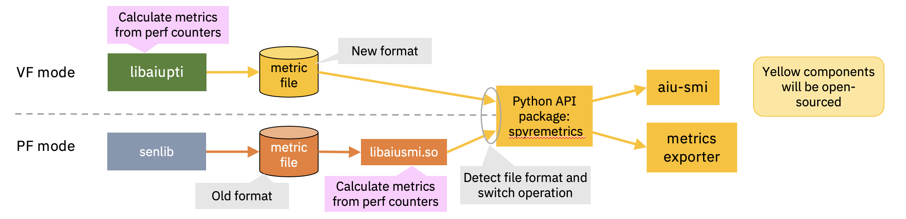

# Spyre Metrics API as a torch-spyre Extension Package

**Authors:**

* @ogatak
* @tatsuhirochiba

---

## Summary

This RFC proposes hosting **`spyre-metrics-api`** (Python import name
`spyremetrics`) inside the `torch-spyre` repository under a new top-level
`extensions/` directory, as an **independently packaged and independently
versioned** Python distribution. 

Spyre Metrics API provides a public Python API for reading and parsing 
IBM Spyre performance metric files that contain hardware performance counters, emitted by the Spyre runtime and driver layer.
It abstracts the binary format, supports both PF- and VF-based metric formats, exposes typed
metric definitions with units and scaling, and acts as the common foundation API
for downstream consumers such as `aiu-smi` and `spyre-metrics-exporter`. 

## Motivation

Performance monitoring and analysis are critical for optimizing workloads on
Spyre. The runtime emits binary metric files (power, temperature, memory
bandwidth, utilization, etc.), but consuming them requires specialized parsing
logic. The raw metric binary also contains a large amount of hardware-internal
information that must not be exposed to users without masking — so a curated,
public API is needed as the single sanctioned access path.

The overall design architecture of the metrics generation and consumption 
is shown in the following figure. spyre-metrics-api plays a key role in providing 
a clean and stable interface for metric data extraction and analysis.



*Figure 1: How Spyre metrics are generated by the runtime/driver and consumed
by downstream tools. `spyre-metrics-api` is the common, stable interface
between the two.*


`spyre-metrics-api` provides a clean Python API that:

* Abstracts the binary file-format details (header, section table, sections).
* Supports both PF-based and VF-based formats, supported on x86, Power, and Z.
* Enables selective metric filtering for efficient extraction.
* Provides metric definitions with proper units and scaling.
* Acts as the **common, export-control-safe interface** so downstream tools
  (`aiu-smi`, `spyre-metrics-exporter`, the profiling toolkit) build on one
  API spec, improving maintainability.

### Why now?

- Performance analysis tools for Spyre are actively being developed, which require a clear & public common API for programmatic metric access.
- We need the clear & public API to the metric access without accessing raw counter values generated by senlib from export control perspective.
- The API is functional for both PF and VF mode in any platforms (x86, Power and Z). PF based metrics are used in Power platform, and VF based metrics are used in Z Platform. 
- The common Metrics API is needed for upcoming release. 
- Integration with monitoring systems (Prometheus & Grafana) in OpenShift


### Why putting it into a new top-level `extensions/` directory?

Spyre metrics are shared by many parts of the system. Both the runtime and the
tools built on top of it need to read the same performance metrics in the same
way, so the metrics API is really a common building block, not a part of any
single tool.

Inside PyTorch, these metrics are read through the profiler (via Kineto). But
we also want to read them **outside** of PyTorch — for example, from a CLI or a
monitoring exporter. `spyre-metrics-api` gives all of these consumers one
simple, supported way to read the metrics, whether or not PyTorch is involved.

The metrics API also has its own life cycle, separate from the `torch-spyre`
core. We want to develop, version, and test it on its own, without making it
depend on the core and without affecting the torch-spyre core CI. For these reasons we
keep it as a separate package under `extensions/`, instead of putting it inside
the core backend package.

In short, placing it under `extensions/` lets us:

1. **Keep it close to the backend it observes.** The metrics and the backend
   live in the same repo, so users can track the changes instead of following a cross-repo change. 
2. **Keep its dependencies small and its version independent.** The metrics API
   needs only `numpy` and `psutil`, not `torch`. You can install it without the
   full backend, and it can be released on its own schedule — so it is a
   *separate package*, not a `torch_spyre` submodule.
3. **Stay optional.** Users who only want the backend do not have to install the
   metrics tooling, and users who only want the metrics tooling do not have to
   install the backend.


## Proposed Implementation

### Repository layout

Introduce a top-level `extensions/` directory in `torch-spyre`. Each extension
is a self-contained Python distribution with its own `pyproject.toml`,
version, tests, and PyPI release. The top-level `torch_spyre`
build does **not** bundle extensions; they are built and published as separate
wheels.

```text
  torch-spyre
  ├── pyproject.toml      <= focus on torch core package (explicitly exclude extensions)
  ├── torch_spyre/        <= core torch-spyre package 
  └── extensions/
      ├── spyre-metrics-api/    <= metrics api library
      │   └── pyproject.toml
      └── aiu-smi/              <= CLI diagnostics tool
          └── pyproject.toml
```


### Packaging and versioning

* **Distribution name:** `spyremetrics` 
* **Dependencies:**
  * numpy
  * psutil >= 5.9.6

## Technical Architecture

### Core Components
1. **`MetricFile`** — Main API class representing a metric file
    - Iterator-based metric reading via `read_metrics()`
    - Selective filtering with `set_filters()`
    - Supports both memory-mapped and streaming access

2. **`MetricDataType`** — Type-safe metric definitions
    - Singleton pattern ensures consistent metadata
    - Includes data type, unit, scaling information
    - Defined in `section_types.json` for easy extension

3. **Format Support** — Handles both PF-based and VF-based binary formats
    - Automatic format detection
    - Backward compatibility

### File Format
Binary format with 64-bit alignment:
```
File Header (magic, version, section count, timestamp)
├── Section Size Table
└── Sections
    ├── Section Header (type, size, sequence, timestamp)
    └── Metric Data (typed arrays of performance counters)
```

### Example Usage

```python
from spyremetrics import MetricFile

with MetricFile(metric_file_path) as mf:
    mf.set_filters(['pwr', 'tempr', 'rdmem', 'wrmem', 'avgmem', 'peakmem'])
    for metric, val in mf.read_metrics():
        match metric.name:
            case 'pwr':     pwr     = val
            case 'tempr':   tempr   = val
            case 'rdmem':   rdmem   = val / 1024 / 1024  # convert to GiB
            case 'wrmem':   wrmem   = val / 1024 / 1024  # convert to GiB
            case 'avgmem':  avgmem  = val / 1024 / 1024  # convert to GiB
            case 'peakmem': peakmem = val / 1024 / 1024  # convert to GiB
```


### Justification for hosting it within `torch-spyre`

| Reason | Detail |
|---|---|
| Enables ecosystem growth | Performance tooling is essential for Spyre adoption — developers need an easy-to-use tools/profiler/profiling API to optimize their workloads |
| Industry standard practice | All major accelerator vendors provide open-source performance monitoring APIs (NVIDIA NVML, AMD ROCm SMI, etc.) |
| Community contribution | users can be familiar with spyre behavior, and also can create some 3rd-party tools (visualizer, integration with monitoring system) |
| Red Hat Product | providing clear API would be essential to be a part of Red Hat product |
| Unblocks dependent projects | Monitoring exporters (spyre-metrics-exporter) and profiling tools (aiu-smi) require this as a dependency |

## Metrics

- download counts (PyPI package)
- product adoption (e.g. Red Hat product)
- community contribution and 3rd party tools adoption

## Drawbacks

* **build complexity:** the root build must clearly *exclude* `extensions/`
* **migration cost:** if we later decide a separate repo is better, we need to pay a migration cost, but we can mitigate
by keeping the extension self-contained

## Alternatives

* **Separate repository (in the `torch-spyre` org).** This was the original
  proposal. It gives the API independent governance and a clean PyPI release,
  but loses co-location with the backend it tracks, turns lockstep
  metric-format changes into cross-repo PRs, and duplicates CI and contributor
  setup. The `extensions/` approach keeps independent packaging while avoiding
  that overhead.
* **Fold into the core `torch_spyre` package.** Simplest install story, but it
  forces a `torch` dependency on every metric consumer (CLI, exporter,
  monitoring host), couples the release cadence to the backend, and mixes
  monitoring concerns into the backend package.

## Prior Art

* **Used in the Internal Tool**: we have already implemented and used it in the existing profiling tools. This RFC re-formalizes the API to be used by other tools publicly.

* **Spyre profiling toolkit RFC (0601):** identifies AIU SMI and metric
  collection as stack components; this RFC supplies the foundational API they can also consume.

## Tracking issue

- https://github.com/torch-spyre/torch-spyre/issues/2676