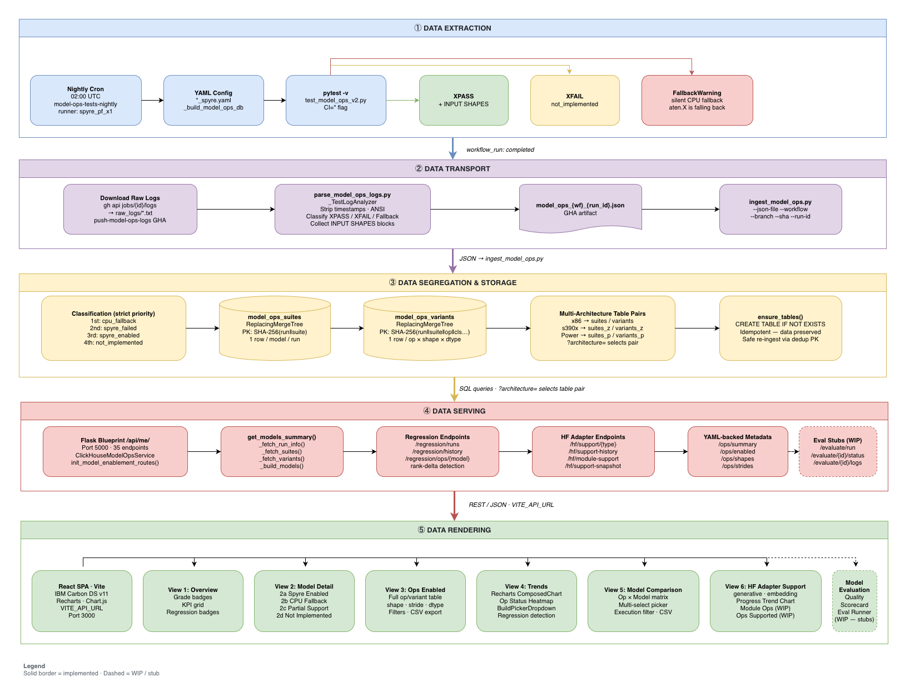

# RFC: Spyre Model-Ops Enablement Dashboard

**Authors:**
- Prasanna GN
- Kanupriya Goyal
- Antoni Viros i Martin
- Rishika Kedia
- Ajit Samuel John
- Saurabh Srivastava
- Goutham Binnadi Gopala


**Tracking issue:** https://github.com/torch-spyre/torch-spyre/issues/2834

---

## 1. Summary

This RFC proposes the **Spyre Model Enablement Dashboard** — an automated, end-to-end observability system that translates raw CI test signals into a structured, queryable dataset and renders that data through interactive dashboard views.

The system:

1. Runs all pytest model-ops test suites on Spyre hardware via GitHub Actions (nightly cron at 02:00 UTC).
2. Downloads raw GHA job logs, parses them with `parse_model_ops_logs.py`, and ingests structured results into ClickHouse via `ingest_model_ops.py`.
3. Serves the data through a Flask Blueprint (`ClickHouseModelOpsService`) on port 5000 via REST endpoints.
4. Renders the data in a Vite + React SPA (IBM Carbon Design System v11) across three hardware architectures: x86, IBM Z (s390x), and IBM Power.

The pipeline translates raw `pytest` `XPASS` / `XFAIL` / `FallbackWarning` signals into a structured, queryable dataset, retained indefinitely to power regression tracking.

---

## 2. Motivation

As the number of supported AI models and operator implementations on Spyre continues to grow, there is no centralised view to accurately assess the enablement status of a model or identify the gaps preventing full execution on Spyre hardware.

When a model is reported as "Spyre-enabled," several critical questions remain unanswered:

- Is the model fully executable on Spyre, or does it rely on silent CPU fallback?
- Which specific operators are executing on CPU instead of Spyre?
- Which operators are implemented but fail for specific tensor shapes or strides?
- What exact shape and stride combinations trigger failures?
- Which unimplemented operators block the most models — and should therefore be prioritised?

Without this visibility, the engineering team cannot measure true Spyre coverage, prioritise operator work by cross-model impact, or detect regressions across releases.

### Goals

The dashboard must enable users to:

1. Determine whether a model runs fully on Spyre or depends on CPU fallback.
2. Visualise the Spyre vs. CPU execution breakdown at the operator level.
3. Identify unimplemented operators preventing complete model execution.
4. Surface operators that fail only for specific shapes, strides, or layouts.
5. Compare operator coverage across models and model families.
6. Prioritise operator development by the number of blocked models and customer impact.
7. Track enablement progress and regression trends across CI releases.
8. Extend all tracking across x86, IBM Z (s390x), and IBM Power architectures.

---

## 3. Proposed Implementation

### 3.1 Architecture Overview

<p align="center">
  
</p>

The system is composed of five sequential stages: **data extraction** (CI), **data transport** (log download + parsing), **data segregation** (classification + ingest), **data serving** (API), and **data rendering** (frontend).

| # | Stage | Owner | Output |
|---|---|---|---|
| ① | Data Extraction | `model-ops-tests-nightly` GHA | Raw pytest logs (XPASS / XFAIL / FallbackWarning) per model suite |
| ② | Data Transport | `push-model-ops-logs-to-clickhouse` GHA | `model_ops_{workflow}_{run_id}.json` |
| ③ | Storage | `ingest_model_ops.py` + ClickHouse | model_ops_suites[ _z] [_p ] ` + ` model_ops_variants[_z][_p] |
| ④ | Serving | Flask Blueprint `/api/me/` (35 endpoints) | JSON REST responses |
| ⑤ | Rendering | React SPA (Carbon v11, Vite) | Six interactive dashboard views |

### 3.2 Op Classification States

Every torch operation encountered during a test run is assigned one of four states, applied in strict priority order by `parse_model_ops_logs.py`:

| Priority | State | Condition | Meaning |
|---|---|---|---|
| 1st | `cpu_fallback` | `FallbackWarning: aten.X is falling back to cpu` emitted in GHA log | Op silently runs on CPU host. Spyre performance not achieved. Supersedes XPASS. |
| 2nd | `spyre_failed` | Same op name appears in both XPASS and XFAIL variants in the same suite | Kernel exists but fails for specific tensor shapes or strides. |
| 3rd | `spyre_enabled` | Pure XPASS with no FallbackWarning and not in mixed set | Op executes natively on Spyre. Desired state. |
| 4th | `not_implemented` | Only XFAIL results, no FallbackWarning | No Spyre kernel. Implementation from scratch required. |

The `cpu_fallback` state is the most important to surface: a model can appear to pass CI while all its compute silently runs on the CPU host.

> **Note on `spyre_failed` detection.** `ClickHouseModelOpsService._build_models()` recomputes this classification in Python after fetching ClickHouse rows by intersecting the `spyre_enabled` op-name set and the `not_implemented` op-name set for the same model. Ops in both sets are promoted to `spyre_failed` and removed from the two original lists. Regression detection uses the priority ranking `spyre_enabled (0) < cpu_fallback (1) < not_implemented (2)` — any increase in rank between consecutive runs is flagged as a regression.

### 3.3 Shape & Stride Granularity

The dashboard records not just *which* ops fail but *which tensor configurations* fail. Spyre kernels are compiled for specific static shapes; an op may work for batch size 1 and fail for batch size 11.

`parse_model_ops_logs.py` extracts the following from the `[INPUT SHAPES]` block that follows each XPASS/XFAIL line in the GHA log:

- `input_shapes` — per-tensor shape strings, e.g. `["[1,12,4096]"]`
- `input_strides` — per-tensor stride strings, e.g. `["[49152,4096,1]"]`
- `input_dtypes` — per-tensor dtype strings, e.g. `["torch.float16"]`
- `arg_values` — scalar / non-tensor argument values
- `target_shape` — reshaped output shape for view/reshape ops

These are stored in ClickHouse as JSON-encoded `String` columns and deserialised by `_parse_json_col()` in `clickhouse_service.py`. Shape-level data is surfaced in the Ops Enabled tab's per-variant rows and is included verbatim in CSV exports.

### 3.4 Op Prioritisation

The **Model Comparison** view provides a cross-model Op × Model matrix. The **Ops Enabled** tab lets engineers search by op name across all models. Both surfaces allow engineers to answer:

*"Which unimplemented op blocks the most models?"*

Sample data from GHA run `#28435688072`:

| Op | Models blocked | Classification |
|---|---|---|
| `torch.nn.functional.linear` | 5 / 7 | `not_implemented` |
| `torch.Tensor.expand` | 5 / 7 | `spyre_failed` |
| `torch.clamp` | 4 / 7 | `not_implemented` |
| `torch.Tensor.contiguous` | 4 / 7 | `spyre_failed` |
| `torch.cos` | 4 / 7 | `cpu_fallback` |
| `torch.sin` | 4 / 7 | `cpu_fallback` |

### 3.5 CI Pipeline

#### 3.5.1 `model-ops-tests` — Test Execution

Defined in `.github/workflows/model_ops_tests_nightly.yaml`. Triggers on:
- Scheduled cron at `02:00 UTC` nightly

**Concurrency:** `cancel-in-progress: true` — only the latest run per nightly job is kept.

**Permissions:** `actions: read` required so the downstream ingest workflow can fetch job logs via `GITHUB_TOKEN`.

**Runner:** `x86_64 · spyre_pf_x1 · linux · image_spyre_backend`. `CI=''` suppresses the GHA `CI=true` env variable, which causes `pytest` inductor tests to fail.

Each job: sparse checkout of composite actions → full checkout of `torch-spyre` → `checkout-pytorch` → `build-torch-spyre` → runs `tests/models/test_model_ops_v2.py` with `-v` flag → derives report name from config filename (e.g. `granite-4.1-8b_spyre.yaml` → `granite-4.1-8b_spyre.xml`) → uploads JUnit XML artifact (`if: always()`).

> JUnit XML is uploaded for reference only. Raw text logs are the authoritative data source because XML does not capture `FallbackWarning` lines or `[INPUT SHAPES]` blocks.

#### 3.5.2 `push-model-ops-logs-to-clickhouse` — Ingest Trigger

Defined in `.github/workflows/push-model-ops-logs-to-clickhouse.yaml`. Triggers on:
- `workflow_run: completed` from `model-ops-tests-nightly` (skipped if `conclusion == cancelled`)
- `workflow_dispatch` with `gha_run_id` input for historical re-ingestion

**Runner:** `spyre_pf_x0`. **Timeout:** 15 min. **Concurrency:** `cancel-in-progress: false`.

**Step 1 — Sparse checkout.** Only `parse_model_ops_logs.py` and `ingest_model_ops.py`.

**Step 2 — Install dependencies.** `uv` venv; `clickhouse-connect`, `regex`; `gh` CLI v2.92.0 from pinned tarball.

**Step 3 — Download raw job logs.**
```bash
gh api /repos/{repo}/actions/runs/{TRIGGERING_RUN_ID}/jobs --paginate \
  --jq '.jobs[] | {id: .id, name: .name}'
# For each job:
gh api /repos/{repo}/actions/jobs/{job_id}/logs → raw_logs/{n}_{safe_name}.txt
```

**Step 4 — Parse logs.**
```bash
python3 .github/scripts/parse_model_ops_logs.py \
    --log-dir raw_logs --run-id "${TRIGGERING_RUN_ID}" \
    --out "model_ops_${SAFE_WF}_${TRIGGERING_RUN_ID}.json"
```

**Step 5 — Ingest into ClickHouse.**
```bash
python3 .github/scripts/ingest_model_ops.py \
    --json-file "${JSON_FILE}" --workflow "${TRIGGERING_WORKFLOW}" \
    --branch "${TRIGGERING_BRANCH}" --sha "${TRIGGERING_SHA}" \
    --run-id "${TRIGGERING_RUN_ID}"
```

Credentials: `CLICKHOUSE_HOST`, `CLICKHOUSE_PORT`, `CLICKHOUSE_USER`, `CLICKHOUSE_PASS`, `CLICKHOUSE_DB`.

**Step 6 — Upload JSON artifact.** `if: always()`.

### 3.6 Log Parsing & JSON Transformation

`parse_model_ops_logs.py` — stateful line-by-line parser (`_TestLogAnalyzer`).

#### 3.6.1 Supported Log Formats

| Format | Pattern | Description |
|---|---|---|
| **GHA Compact** | `RE_TEST_INLINE` | `test_model_ops_v2.py::Class::test_name XPASS\|XFAIL` — status inline |
| **Stall-watcher** | `RE_TEST_STALL` | Test name and status split across two lines by stall-watcher output |
| **Legacy verbose** | `RE_OP_LINE` | `Op: torch.mul \| Test: test_name` — status on separate line |
| **FallbackWarning** | `RE_FALLBACK_ATEN` | `FallbackWarning: aten.X.Y is falling back to cpu` |

After any XPASS line, the parser reads an optional `[INPUT SHAPES]` block with `arg[N]: Tensor(shape=…, dtype=…, stride=…)`, `TensorList[…]`, `value=…`, `py=…`, and `Target shape:` entries.

#### 3.6.2 Op Name Normalisation

| Test name | Derived op |
|---|---|
| `test_model_ops_db_torch_mul__1_spyre_float16` | `torch.mul` |
| `test_model_ops_db_torch_Tensor_contiguous__49_spyre_float16` | `torch.Tensor.contiguous` |
| `test_model_ops_db_torch_nn_functional_linear__23_spyre_float16` | `torch.nn.functional.linear` |
| `test_model_ops_db_torch___eq____43_spyre_int64` | `torch.__eq__` |

Aliases: `aten.cos.default` → `torch.cos`, `aten.embedding.default` → `torch.nn.functional.embedding`, `aten.index_copy.out` → `torch.index_copy_`.

#### 3.6.3 Classification Priority (within `_TestLogAnalyzer`)

1. **`cpu_fallback`** — `FallbackWarning` emitted.
2. **`spyre_failed`** — op appears in both `xpass_set` and `xfail_set` within the same suite.
3. **`spyre_enabled`** — pure XPASS after removing fallback and mixed ops.
4. **`not_implemented`** — pure XFAIL after removing mixed ops.

#### 3.6.4 Suite-Level Stats

Extracted from the final pytest summary line:
```
================== 18 xpassed, 225 xfailed in 314.7s ==================
```
Emits: `suite_outcome`, `suite_exit_code`, `suite_tests_total`, `suite_tests_passed`, `suite_tests_failed`, `suite_tests_xfail`, `suite_tests_xpass`, `suite_duration_s`.

### 3.7 ClickHouse Schema & Ingestion

#### 3.7.1 `model_ops_suites` — One row per model suite per GHA run

Primary key: `suite_id = SHA-256(gha_run_id ‖ suite_name)`. Engine: `ReplacingMergeTree(ingested_at)`.

```sql
CREATE TABLE model_ops_suites (
    suite_id              FixedString(64),   -- PK
    gha_run_id            UInt64,
    run_id                String,
    workflow              LowCardinality(String) DEFAULT '',
    branch                LowCardinality(String) DEFAULT '',
    commit_sha            String DEFAULT '',
    suite_name            String,
    model_name            LowCardinality(String) DEFAULT '',
    yaml_file             String DEFAULT '',
    total_tests           UInt32 DEFAULT 0,
    spyre_enabled_count   UInt32 DEFAULT 0,
    not_implemented_count UInt32 DEFAULT 0,
    cpu_fallback_count    UInt32 DEFAULT 0,
    spyre_failed_count    UInt32 DEFAULT 0,
    suite_outcome         LowCardinality(String) DEFAULT 'unknown',
    suite_exit_code       Nullable(Int32),
    tests_total           UInt32 DEFAULT 0,
    tests_passed          UInt32 DEFAULT 0,
    tests_failed          UInt32 DEFAULT 0,
    tests_skipped         UInt32 DEFAULT 0,
    tests_error           UInt32 DEFAULT 0,
    tests_xfail           UInt32 DEFAULT 0,
    tests_xpass           UInt32 DEFAULT 0,
    duration_s            Float32 DEFAULT 0,
    triggered_at          DateTime64(3, 'UTC'),
    ingested_at           DateTime64(3, 'UTC')
) ENGINE = ReplacingMergeTree(ingested_at)
ORDER BY suite_id
PARTITION BY toYYYYMM(triggered_at)
SETTINGS index_granularity = 8192
```

#### 3.7.2 `model_ops_variants` — One row per op × shape × dtype

Primary key: `variant_id = SHA-256(gha_run_id ‖ suite_name ‖ operation ‖ classification ‖ test_name ‖ seq)`.

```sql
CREATE TABLE model_ops_variants (
    variant_id     FixedString(64),          -- PK
    suite_id       FixedString(64),          -- FK → model_ops_suites
    gha_run_id     UInt64,
    run_id         String,
    workflow       LowCardinality(String) DEFAULT '',
    branch         LowCardinality(String) DEFAULT '',
    commit_sha     String DEFAULT '',
    suite_name     String,
    model_name     LowCardinality(String) DEFAULT '',
    yaml_file      String DEFAULT '',
    operation      LowCardinality(String),
    classification LowCardinality(String),   -- spyre_enabled|not_implemented|cpu_fallback
    test_name      String,
    status         LowCardinality(String),   -- XPASS|XFAIL|FALLBACK
    input_shapes   String DEFAULT '[]',      -- JSON array of shape strings
    input_strides  String DEFAULT '[]',
    input_dtypes   String DEFAULT '[]',
    arg_values     String DEFAULT '[]',
    target_shape   String DEFAULT '',
    triggered_at   DateTime64(3, 'UTC'),
    ingested_at    DateTime64(3, 'UTC'),
    tags           String DEFAULT ''
) ENGINE = ReplacingMergeTree(ingested_at)
ORDER BY variant_id
PARTITION BY toYYYYMM(triggered_at)
SETTINGS index_granularity = 8192
```

#### 3.7.3 Multi-Architecture Table Pairs

| Architecture | Suites table | Variants table |
|---|---|---|
| x86 (default) | `model_ops_suites` | `model_ops_variants` |
| IBM Z (s390x) | `model_ops_suites_z` | `model_ops_variants_z` |
| IBM Power | `model_ops_suites_p` | `model_ops_variants_p` |

All API endpoints accept `?architecture=x86|s390x|power`. An unrecognised value raises `ValueError` — there is no silent fallback to x86.

#### 3.7.4 Table Lifecycle

`ensure_tables()` runs on every ingest — tables are **preserved** across runs so the dashboard can show regression trends across nightly builds:

```python
# idempotent — existing tables and their historical data are left untouched
client.command(_CREATE_SUITES_SQL)    # CREATE TABLE IF NOT EXISTS model_ops_suites
client.command(_CREATE_VARIANTS_SQL)  # CREATE TABLE IF NOT EXISTS model_ops_variants
```
#### 3.7.5 Primary Key Construction

```python
def _make_id(*parts: str) -> str:
    return hashlib.sha256("\x00".join(str(p) for p in parts).encode()).hexdigest()

suite_id   = _make_id(gha_run_id, suite_name)
variant_id = _make_id(gha_run_id, suite_name, operation, classification, test_name, seq)
```

#### 3.7.6 Core SQL Queries

The service uses 8 SQL templates (all parameterised with `{{suites}}` / `{{variants}}` placeholders resolved per architecture):

| Template | Purpose | Rows returned |
|---|---|---|
| `_SQL_LATEST_RUN` | Latest `gha_run_id` + `max(commit_sha)` | 1 |
| `_SQL_ALL_RUNS` | All unique runs (oldest→newest) | N |
| `_SQL_MODEL_HISTORY` | Per-run counts for one model | N |
| `_SQL_ALL_MODELS_HISTORY` | Aggregated per-run counts across all models | N |
| `_SQL_OP_HISTORY` | Per-op classification across runs for one model | O × N |
| `_SQL_OP_HISTORY_ALL` | Per-op classification across all models + runs | O × M × N |
| `_SQL_SUITES` | Suite-level metadata for a run | M |
| `_SQL_VARIANTS` | Variant-level metadata for a run | V |

### 3.8 Backend API Layer

**File:** `backend/routes/model_enablement.py` (956 lines)
**Registered by:** `app.py` via `init_model_enablement_routes(execute_clickhouse_query)`
**Prefix:** `/api/me/`

All endpoints accepting data from ClickHouse support `?architecture=x86|s390x|power`.

#### 3.8.1 Endpoint Reference

**Health & Connectivity**

| Endpoint | Description |
|---|---|
| `GET /health` | Liveness probe |
| `GET /ch/health` | ClickHouse connectivity + latest run_id, commit_sha, branch, workflow |

**Core Enablement**

| Endpoint | Params | Description |
|---|---|---|
| `GET /tabs/enablement` | `?model_filter=` `?architecture=` | Full enablement payload: models[], summary{}, run_id, commit_sha, branch |
| `GET /models/ops-data` | `?model_filter=` `?architecture=` | Model summary list |
| `GET /models/ops-data/{model}` | `?architecture=` | Single model with all classified op lists |
| `GET /models/ops-data/{model}/shapes` | `?architecture=` | All variants flattened per classification |
| `GET /models/ops-data/{model}/filter/{cls}` | `?architecture=` | One classification only (`spyre_enabled\|cpu_fallback\|not_implemented\|spyre_failed`) |
| `GET /models` | `?architecture=` | Flat model list with Enabled/Pending status |

**Regression & History Tracking**

| Endpoint | Params | Description |
|---|---|---|
| `GET /regression/runs` | `?architecture=` | All ingested nightly runs metadata, oldest→newest |
| `GET /regression/history` | `?model_name=` `?architecture=` | Per-run classification counts (aggregate or per-model) |
| `GET /regression/ops/{model}` | `?architecture=` | Per-op classification history + detected regressions |
| `GET /regression/ops-all` | `?architecture=` | Per-op history across all models (aggregate) |

**HuggingFace Adapter Support**

| Endpoint | Params | Description |
|---|---|---|
| `GET /hf/support/{generative\|embedding}` | — | Latest snapshot rows: model_name, adapter_name, verified_on_spyre |
| `GET /hf/module-support` | — | HF module test results from latest `gha_run_id` |
| `GET /hf/support-history` | `?model_type=` | Per-snapshot supported/not-supported/no-adapter/unique-adapter counts |
| `GET /hf/support-snapshot` | `?date=YYYY-MM-DD` `?model_type=` | Per-model rows for a specific snapshot date |

**YAML-backed Ops Metadata**

| Endpoint | Description |
|---|---|
| `GET /ops/summary` | Op counts from YAML configs; `?model_filter=` |
| `GET /ops/enabled` | All `spyre_enabled` ops from YAML |
| `GET /ops/models` | All models' ops from YAML |
| `GET /ops/models/{model}` | Single model ops from YAML or 404 |
| `GET /ops/shapes` | All shapes across all models |
| `GET /ops/shapes/{model}` | Shapes for one model |
| `GET /ops/strides` | All stride patterns |

**Module Tests**

| Endpoint | Description |
|---|---|
| `GET /tabs/modules` | HF module test results (latest run) with spyre/cpu/not_impl summary |

**Dashboard & Config**

| Endpoint | Description |
|---|---|
| `GET /dashboard/enablement` | YAML-backed dashboard view with `?model_filter=` |
| `GET /tabs/evaluation` | Model quality scores from ClickHouse |
| `GET /tabs/config` | System config metadata |

**Evaluation (stubs — in progress)**

| Endpoint | Description |
|---|---|
| `GET /evaluate/models/metrics` | Stub — returns `{}` |
| `POST /evaluate/run` | Stub — returns `{eval_id, status: "queued"}` (HTTP 202) |
| `GET /evaluate/{eval_id}/status` | Stub — returns `{status: "completed", progress: 100}` |
| `GET /evaluate/{eval_id}/logs` | Stub — returns `{logs: [], complete: true}` |
| `GET /ops/benchmark/{op}` | Synthetic benchmark metrics; `?shape=` |
| `GET /ch/models/summary` | Raw `get_models_summary()` passthrough |
| `GET /ch/models/{model}` | Single model from ClickHouse |
| `GET /ch/tabs/enablement` | Raw `get_models_summary()` passthrough |

#### 3.8.2 `ClickHouseModelOpsService` — Query Flow

`get_models_summary(model_filter, architecture)`:

1. `_fetch_run_info(architecture)` → latest `gha_run_id` + metadata
2. `_fetch_suites(run_id, architecture)` → suite rows indexed by `model_name`
3. `_fetch_variants(run_id, architecture)` → variant rows; JSON cols deserialised via `_parse_json_col()`
4. `_build_models(suites, variants, model_filter)`:
   - `by_model[model][classification][op] → [variant_record]`
   - `spyre_failed` = `xpass_ops ∩ xfail_ops` per model → promote, remove from pure lists
   - `_group_ops()` → `[{operation, variant_count, variants}]` sorted alpha
5. `sanitize_for_json()` → replace `inf`/`nan` → `None`

### 3.9 Frontend Layer

**Root:** `frontend_react/src/components/model-enablement-dashboard/`
**Stack:** Vite + React 18, IBM Carbon Design System v11, Recharts, Chart.js
**Environment:** `VITE_API_URL` (default `http://localhost:5000/api`)

#### 3.9.1 Component Map

| Component | Location | Views |
|---|---|---|
| `Dashboard.jsx` | `components/` | Shell, tab routing, architecture picker, data loading |
| `ModelEnablementPage.jsx` | `components/model-enablement/` | Overview, Model Detail, Ops Enabled, Model Comparison |
| `RegressionView.jsx` | `components/shared/` | Trends: chart, heatmap, regression detection, BuildPicker |
| `HfAdapterPage.jsx` | `components/hf-adapter/` | HF Support Grid, Module Ops (WIP), Progress Trend |
| `ModelEvaluationPage.jsx` | `components/model-evaluation/` | Quality Scorecard, Benchmark Results, Evaluation Log |
| `BuildPickerDropdown.jsx` | `components/shared/` | Multi-select run picker with GHA/Jenkins links |
| `ConfigPage` | `components/Dashboard.jsx` | Framework settings UI |

#### 3.9.2 `modelService.js` — Service Functions

**File:** `services/modelService.js` (1113 lines)

| Category | Functions |
|---|---|
| Enablement | `getEnablementTabData(filter, arch)`, `getComprehensiveOpsData(filter, arch)`, `loadDashboardData(arch)` |
| Regression | `getRegressionRuns(arch)`, `getRegressionHistory(model, arch)`, `getRegressionOps(model, arch)`, `getRegressionOpsAll(arch)` |
| HF Support | `getHfSupportData(type)`, `getHfModuleSupportData()`, `getHfSupportHistory(type)`, `getHfSupportSnapshot(date, type)` |
| Ops Meta | `getOpsSummary()`, `getOpsEnabled()`, `getAllModelsOps()`, `getModelOpsData(name)`, `getAllShapes()`, `getModelShapes(name)`, `getAllStrides()`, `getOpBenchmark(op, shape)` |
| Evaluation | `runEvaluation(model, device)`, `getEvaluationStatus(id)`, `streamEvaluationLogs(id, cbs)` |
| Connectivity | `chHealthCheck()`, `chGetModelsSummary()` |

#### 3.9.3 Architecture Picker

`Dashboard.jsx` renders a header dropdown with three options:

| Label | Value | ClickHouse tables | Build links |
|---|---|---|---|
| x86 | `x86` | `model_ops_suites` / `model_ops_variants` | GitHub Actions |
| IBM Z (s390x) | `s390x` | `model_ops_suites_z` / `model_ops_variants_z` | Jenkins |
| IBM Power | `power` | `model_ops_suites_p` / `model_ops_variants_p` | Jenkins |

Selecting a platform triggers a full re-fetch of all dashboard data via `loadDashboardData(platform)` and clears regression history caches.

#### 3.9.4 Dashboard Views

The React frontend is built on **IBM Carbon Design System v11** (`IBM Plex Sans`, `IBM Plex Mono`, Carbon color tokens). All six views described below are implemented and production-ready.

**View 1 — Overview**

One tile per model suite showing:
- Grade badge: **Enabled** (all ops on Spyre) or **In Progress** (gaps remain)
- KPI grid: Spyre Enabled / CPU Fallback / Not Implemented / Spyre+Failed counts
- Spyre coverage progress bar (% ops on Spyre)
- **Regression badge** per model: N regressions (red) or clean (green), sourced from the live regression detection in the Trends tab

Summary bar at top: aggregate counts, last run's branch, commit SHA, and timestamp.

**View 2 — Model Detail**

Four sub-panels for a selected model:
- **2a Spyre Enabled** — ops emitting `XPASS`; shape/stride/dtype variants per op.
- **2b CPU Fallback** — ops emitting `FallbackWarning`; highlights silent CPU execution.
- **2c Partial Support** — expandable row per `spyre_failed` op showing `xpass_variants` (working shapes) and `xfail_variants` (failing shapes) side by side.
- **2d Not Implemented** — flat table sorted by `variant_count DESC`; ops requiring kernel implementation.

**View 3 — Ops Enabled Tab**

Full operator table across all models (or a single selected model):

| Column | Content |
|---|---|
| Operator | Op name (IBM Plex Mono); ▶/▼ toggle for multi-variant ops |
| Input Shape | Tensor shape, e.g. `[1, 512, 4096]` |
| Strides | Tensor strides, e.g. `(49152, 4096, 1)` |
| Dtype | Data type tags (FP16, BF16, FP32, …) |
| Execution | Classification tag: Spyre / CPU Fallback / Not Implemented / Spyre+Failed |
| Performance | "View Details" button (scaffold present; benchmark data available once enabled) |

**Filters:** model picker · execution status · free-text search · Expand All / Collapse All

**CSV Download:** filename `ops-enabled-{commit8}-run{runId}-{workflow-slug}-{model}.csv`. Report includes header rows for Run ID, Run Name (workflow), Commit SHA, Architecture, and a category summary section before the per-variant detail rows.

```
"Ops Suite Summary — {model}"

"Metric","Value"
"Model Filter","{model}"
"Run ID","{runId}"
"Run Name","{workflow}"
"Commit SHA","{commitSha}"
"Architecture","{arch}"
"Generated","{timestamp}"

"Category","Op Groups","Description"
"Spyre Enabled","{n}","Ops that run natively on the Spyre accelerator"
"CPU Fallback","{n}","Ops not yet supported on Spyre; falls back to host CPU"
"Not Implemented","{n}","Ops with no implementation path"
"Spyre+Failed","{n}","Ops registered for Spyre but with failing variants"
"Total","{n}","All op groups across selected models"

"Op Detail — Individual Variants"
"Model","Operation","Execution","Variant Status","Input Shape","Input Stride","Dtype","Test Name","Tags"
{one row per variant}
```

**View 4 — Trends (Regression Tracking)**

Build history axis (oldest → newest) driven by `GET /api/me/regression/runs`.

- **KPI Strip:** Per-run unique op counts for Spyre Enabled / CPU Fallback / Not Implemented / Spyre+Failed. Unique op counts come from `get_op_history_all()` (more accurate than summing suite-level aggregates).
- **Trend Chart:** Recharts ComposedChart; stacked bars per classification + trend line over selected builds. Interactive tooltip shows commit SHA, workflow, and a link to the GHA run (or Jenkins for s390x/Power).
- **Op Status Heatmap:** Row per operation, column per selected build. Cells are colour-coded by classification (green / orange / red / purple). Ops with detected regressions bubble to the top with a red ⚠ badge (`OpRegressionBadge` component).
- **Spyre Failed Breakdown Table:** Per-model list of mixed ops with xpass_count, xfail_count, and the full variant lists.
- **BuildPickerDropdown:** Multi-select run picker; newest first; each entry shows date, build number, "latest" badge, GHA/Jenkins link, short commit SHA, and branch badge (non-main only). "Select All" / "Clear" buttons + footer showing counts.

**View 5 — Model Comparison**

Cross-model Op × Model matrix:
- Rows: All unique op names across selected models (alphabetical)
- Columns: Selected models (multi-select checkbox picker with Select All / Clear)
- Cells: Classification tag or — (op absent in that model)
- Ops common to most models surface at the top

**Filters:** op name picker · execution status filter

**CSV Download:** filename `model-comparison-{commit8}-run{runId}-report.csv`.

```
"Model Comparison Report"

"Run ID","{runId}"
"Commit SHA","{commitSha}"
"Architecture","{arch}"
"Generated","{timestamp}"
"Models Compared","{n}"
"Op Filter","{filter}"
"Execution Filter","{filter}"
"Total Unique Ops (selected models)","{n}"

"Models in Comparison"
"model1","model2","model3",...

"Op Comparison Matrix"
"Operation","model1","model2",...
{one row per op}
```

**View 6 — HF Adapter Support**

Tracks HuggingFace Adapter model support status across `generative` and `embedding` model types.

- **Model Support Grid:** Table showing model_name, family, adapter_name, verified_on_cpu, verified_on_gpu, verified_on_spyre, parameters, downloads. Sortable by family (Granite first) then alphabetically. 50 rows per page.
- **Summary Metrics:** Total models / Verified on Spyre / Not Verified / No Adapter / Unique Adapters count.
- **Progress Trend Chart:** Recharts ComposedChart; x-axis = snapshot dates; left y-axis = supported/not-supported/no-adapter counts; right y-axis = unique adapters (line overlay).
- **Snapshot Selector:** Dropdown to pick a historical snapshot date; grid updates to show per-model status for that date.
- **Module Ops tab** (in progress): Module-level test results from `hf_module_test_results` ClickHouse table.
- **Ops Supported tab** (in progress): Operator-level coverage per HF model.

### 3.10 Regression Detection

Regression detection runs in two places:

**Backend (`clickhouse_service.py`):**
```python
_RANK = {"spyre_enabled": 0, "cpu_fallback": 1, "not_implemented": 2}

for i in range(1, len(run_bests)):
    prev, curr = run_bests[i-1], run_bests[i]
    if _RANK.get(curr["classification"], 99) > _RANK.get(prev["classification"], 99):
        regressions.append({
            "operation":           op,
            "prev_classification": prev["classification"],
            "curr_classification": curr["classification"],
            "run_id":              curr["run_id"],
            "prev_run_id":         prev["run_id"],
            "triggered_at":        curr["triggered_at"],
        })
```

**Frontend (`RegressionView.jsx`, `ModelEnablementPage.jsx`):**
- Regressions surfaced as red ⚠ badges on Overview tiles (`OpRegressionBadge`)
- Ops with regressions float to the top of the Op Status Heatmap
- Trend chart tooltip shows "worsened from {prev} to {curr} in build #{run_id}"


## 4. Future Work

### 4.1 HF Module Ops Tab

The `hf_module_test_results` ClickHouse table is live and populated by the `hf-adapters` CI pipeline. The `GET /tabs/modules` endpoint returns data. The frontend tab scaffold is present with a WIP banner. Completing this view requires finalising the module-level classification display and connecting it to the existing `BuildPickerDropdown` for historical navigation.

### 4.2 HF Ops Supported Tab

Operator-level coverage per HuggingFace model is available from the existing `model_ops_variants` data by joining on `model_name`. The UI scaffold is prepared. This tab would surface per-HF-model op coverage directly within the HF Adapter Support view, eliminating the need to cross-reference with the main Ops Enabled tab.

### 4.3 Model Evaluation Dashboard

Quality scorecard and evaluation runner pages exist as React components and Flask endpoints. Full activation requires:
- Integration with the Spyre inference engine for live benchmark execution.
- Populating the `model_quality_scores` ClickHouse table (currently empty).
- Connecting `/evaluate/run` → inference engine → `/evaluate/{id}/status` polling → `/evaluate/{id}/logs` streaming.

### 4.4 Performance Benchmarks in Ops Enabled Tab

The "View Details" button scaffold is present in View 3. `/ops/benchmark/{op}` returns synthetic data. Production activation requires:
- Benchmarking harness integration with the nightly CI run.
- Schema extension to `model_ops_variants` or a new `model_ops_benchmarks` table.
- Latency, throughput, and memory columns surfaced in the per-variant row detail panel.

### 4.5 Keyword Argument Layout Specs

The current `_to_target_device` implementation only propagates layout specs to positional arguments. A future iteration could extend `sample_inputs_func` to also carry specs for keyword arguments, enabling fully layout-correct tests for operations that take tensor kwargs (e.g., `weight`, `bias`).

### 4.6 Cross-Architecture Regression Alerts

Today, regression detection operates within a single architecture. A future enhancement would detect *cross-architecture divergence*: ops that are `spyre_enabled` on x86 but `not_implemented` on s390x, flagged as platform-specific gaps requiring targeted work. This would require a JOIN across the `_z` / `_p` table pairs and a new frontend view surface.

